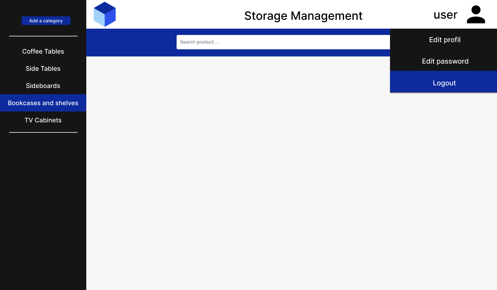
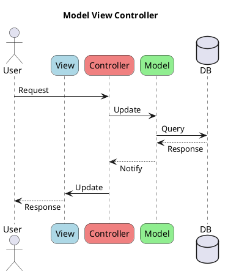
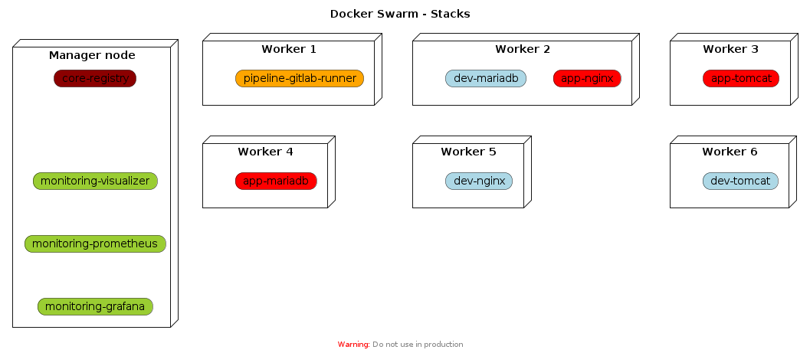

# Rapport

M. Thibault HULAUX
Mlle Lylou PONSING

Concepteur et Developpeur d'Application
Niveau II

Periode d'exercice du 19/04/2022 du 20/01/2023

<div style="page-break-after: always;"></div>

## 1. Table des matières<!-- OK -->

<!-- cSpell:disable -->
- [1. Table des matières](#1-table-des-matières)
- [2. Liste des compétences couvertes](#2-liste-des-compétences-couvertes)
- [3. Résumé du projet en anglais](#3-résumé-du-projet-en-anglais)
- [4. Cahier des charges](#4-cahier-des-charges)
  - [4.1. Contexte de l'entreprise](#41-contexte-de-lentreprise)
  - [4.2. Définition du besoin](#42-définition-du-besoin)
    - [4.2.1. La méthode QQOQCP](#421-la-méthode-qqoqcp)
    - [4.2.2. Les Personas](#422-les-personas)
      - [4.2.2.1. Marie Dubois - Responsable dans une association](#4221-marie-dubois---responsable-dans-une-association)
      - [4.2.2.2. Mathieu Dupont - Gérant](#4222-mathieu-dupont---gérant)
  - [4.3. Objectif du projet](#43-objectif-du-projet)
  - [4.4. Description de toutes les fonctionnalités attendues](#44-description-de-toutes-les-fonctionnalités-attendues)
    - [4.4.1. Inscription](#441-inscription)
      - [4.4.1.1. Fonctionnalité : Inscription](#4411-fonctionnalité--inscription)
    - [4.4.2. Authentification](#442-authentification)
      - [4.4.2.1. Fonctionnalité : Authentification](#4421-fonctionnalité--authentification)
    - [4.4.3. Catégorie](#443-catégorie)
      - [4.4.3.1. Fonctionnalité: Ajouter une catégorie](#4431-fonctionnalité-ajouter-une-catégorie)
      - [4.4.3.2. Fonctionnalité: Supprimer une catégorie](#4432-fonctionnalité-supprimer-une-catégorie)
      - [4.4.3.3. Fonctionnalité: Modifier une catégorie](#4433-fonctionnalité-modifier-une-catégorie)
      - [4.4.3.4. Fonctionnalité: Accéder aux informations d'une catégorie](#4434-fonctionnalité-accéder-aux-informations-dune-catégorie)
    - [4.4.4. Produit](#444-produit)
      - [4.4.4.1. Fonctionnalité: Ajouter un produit](#4441-fonctionnalité-ajouter-un-produit)
      - [4.4.4.2. Fonctionnalité: Modifier un produit](#4442-fonctionnalité-modifier-un-produit)
      - [4.4.4.3. Fonctionnalité: Supprimer un produit](#4443-fonctionnalité-supprimer-un-produit)
      - [4.4.4.4. Fonctionnalité: Accéder aux informations d'un produit](#4444-fonctionnalité-accéder-aux-informations-dun-produit)
  - [4.5. Délais](#45-délais)
- [5. Gestion de projet](#5-gestion-de-projet)
  - [5.1. Planning et suivi](#51-planning-et-suivi)
  - [5.2. Environnement humain et technique](#52-environnement-humain-et-technique)
    - [5.2.1. Environnement humain](#521-environnement-humain)
    - [5.2.2. Environnement technique](#522-environnement-technique)
  - [5.3. Objectif qualité](#53-objectif-qualité)
- [6. Spécifications fonctionnelles du projet](#6-spécifications-fonctionnelles-du-projet)
  - [6.1. Front office](#61-front-office)
    - [6.1.1. Landing page](#611-landing-page)
    - [6.1.2. Inscription et connexion](#612-inscription-et-connexion)
    - [6.1.3. Catégories](#613-catégories)
      - [6.1.3.1. Menu catégorie](#6131-menu-catégorie)
      - [6.1.3.2. Ajout d’une catégorie](#6132-ajout-dune-catégorie)
      - [6.1.3.3. Information et modification d’une catégorie](#6133-information-et-modification-dune-catégorie)
      - [6.1.3.4. Suppression d’une catégorie](#6134-suppression-dune-catégorie)
    - [6.1.4. Produits](#614-produits)
      - [6.1.4.1. Information produit](#6141-information-produit)
      - [6.1.4.2. Ajout d’un produit](#6142-ajout-dun-produit)
      - [6.1.4.3. Modifier un produit](#6143-modifier-un-produit)
      - [6.1.4.4. Supprimer un produit](#6144-supprimer-un-produit)
    - [6.1.5. Menu user](#615-menu-user)
  - [6.2. Back office](#62-back-office)
  - [6.3. Arborescence](#63-arborescence)
  - [6.4. Aperçu des contenus](#64-aperçu-des-contenus)
    - [6.4.1. Charte graphique](#641-charte-graphique)
    - [6.4.2. Maquette](#642-maquette)
- [7. Spécifications techniques du projet](#7-spécifications-techniques-du-projet)
  - [7.1. Langages](#71-langages)
    - [7.1.1. Front-end](#711-front-end)
      - [7.1.1.1. HTML](#7111-html)
      - [7.1.1.2. CSS / SASS](#7112-css--sass)
      - [7.1.1.3. JavaScript](#7113-javascript)
    - [7.1.2. Back-end](#712-back-end)
      - [7.1.2.1. Java](#7121-java)
      - [7.1.2.2. JSP](#7122-jsp)
      - [7.1.2.3. JSTL](#7123-jstl)
      - [7.1.2.4. SQL](#7124-sql)
    - [7.1.3. Autres](#713-autres)
      - [7.1.3.1. Dockerfile](#7131-dockerfile)
      - [7.1.3.2. Python](#7132-python)
      - [7.1.3.3. Shell](#7133-shell)
      - [7.1.3.4. XML](#7134-xml)
      - [7.1.3.5. YAML](#7135-yaml)
  - [7.2. Frameworks](#72-frameworks)
    - [7.2.1. JAAS](#721-jaas)
    - [7.2.2. reveal.js](#722-revealjs)
  - [7.3. Versioning (gitlab/github)](#73-versioning-gitlabgithub)
    - [7.3.1. GitLab](#731-gitlab)
  - [7.4. SGBD utilisé (MYSQL/PostgreSQL)](#74-sgbd-utilisé-mysqlpostgresql)
    - [7.4.1. MariaDB](#741-mariadb)
  - [7.5. Outils de maquettage](#75-outils-de-maquettage)
    - [7.5.1. Figma](#751-figma)
    - [7.5.2. PlantUML](#752-plantuml)
  - [7.6. Plateforme de développement](#76-plateforme-de-développement)
    - [7.6.1. Automatisation de build](#761-automatisation-de-build)
    - [7.6.2. Containérisation et services](#762-containérisation-et-services)
      - [7.6.2.1. Docker](#7621-docker)
      - [7.6.2.2. Docker Compose](#7622-docker-compose)
      - [7.6.2.3. Docker Swarm](#7623-docker-swarm)
    - [7.6.3. Virtualisation](#763-virtualisation)
      - [7.6.3.1. Oracle VM Virtualbox](#7631-oracle-vm-virtualbox)
      - [7.6.3.2. VMware ESXi](#7632-vmware-esxi)
  - [7.7. Outils de conception de la documentation](#77-outils-de-conception-de-la-documentation)
    - [7.7.1. Markdown](#771-markdown)
    - [7.7.2. Javadoc](#772-javadoc)
    - [7.7.3. PlantUML](#773-plantuml)
- [8. Réalisations](#8-réalisations)
  - [8.1. Description des features réalisées](#81-description-des-features-réalisées)
    - [8.1.1. Authentification et inscription](#811-authentification-et-inscription)
    - [8.1.2. Gestion des catégories](#812-gestion-des-catégories)
    - [8.1.3. Gestion des produits](#813-gestion-des-produits)
  - [8.2. Description des fonctions implémentées](#82-description-des-fonctions-implémentées)
    - [8.2.1. Supprimer une catégorie](#821-supprimer-une-catégorie)
    - [8.2.2. Modifier un produit](#822-modifier-un-produit)
    - [8.2.3. Authentification](#823-authentification)
  - [8.3. Description des actions réalisées sur la BDD](#83-description-des-actions-réalisées-sur-la-bdd)
    - [8.3.1. Create](#831-create)
    - [8.3.2. Read](#832-read)
    - [8.3.3. Update](#833-update)
    - [8.3.4. Delete](#834-delete)
  - [8.4. Description des tests unitaires/EtE(EndtoEnd)](#84-description-des-tests-unitaireseteendtoend)
- [9. Présentation du jeu d'essai le plus représentatif](#9-présentation-du-jeu-dessai-le-plus-représentatif)
- [10. Veille sur les vulnérabilités de sécurité](#10-veille-sur-les-vulnérabilités-de-sécurité)
  - [Securiser HTTP (SSL)](#securiser-http-ssl)
  - [SQL Injection](#sql-injection)
- [11. Description d'une situation de travail ayant nécessité une recherche](#11-description-dune-situation-de-travail-ayant-nécessité-une-recherche)
<!-- cSpell:enable -->

<div style="page-break-after: always;"></div>

## 2. Liste des compétences couvertes<!-- OK -->

La liste des compétences couvertes, conformément au référentiel de certification, est la suivante:

|     | Description                                                                                              |
| --- | -------------------------------------------------------------------------------------------------------- |
| 1   | Maquetter une application                                                                                |
| 2   | Développer une interface utilisateur de type desktop                                                     |
| 3   | Développer des composants d'accès aux données                                                            |
| 4   | Développer la partie front-end d'une interface utilisateur web                                           |
| 5   | Développer la partie back-end d'une interface utilisateur web                                            |
| 6   | Concevoir une base de données                                                                            |
| 7   | Mettre en place une base de données                                                                      |
| 8   | Développer des composants dans le langage d'une base de données                                          |
| 9   | Collaborer à la gestion d'un projet informatique et à l'organisation de l'environnement de développement |
| 10  | Concevoir une application                                                                                |
| 11  | Développer des composants métier                                                                         |
| 12  | Construire une application organisée en couches                                                          |
| 13  | Développer une application mobile                                                                        |
| 14  | Préparer et exécuter les plans de tests d'une application                                                |
| 15  | Préparer et exécuter le déploiement d'une application                                                    |

<div style="page-break-after: always;"></div>

## 3. Résumé du projet en anglais

```md
  - 20 lignes (200-250 mots, 1200 caractères
  - Qui / Quoi / Où / Quand / Comment / Combien / Pourquoi)
```

Today we're going to analyse together an explicit breakdown of a basic modern web application.

For the sake of this demonstration, we're going to assume the following:

- The client is a service company which facilitates storage management and is willing to provide his customers with a related online service.
- The deliverable address a specific need of simple storage management solutions for associations and small business.
- The resulting application is deployed online (either in the cloud or on premise), so end users can access it from anywhere.
- The deliverable due date is 2022 November 4th.
- This application is built on modern standards, and relies on multiple containerized services, that can be deployed nearly anywhere. After registering / signing-in, users can administrate with ease private collections of categories of products.
- The end goal is to provide users with a simple to handle storage management solution.

<div style="page-break-after: always;"></div>

## 4. Cahier des charges<!-- OK -->

- Contexte de l'entreprise
- Définition du besoin
- Objectif du projet
- Description de toutes les fonctionnalités attendues
- Délais

### 4.1. Contexte de l'entreprise<!-- OK -->

Nous avons supposé pour ce projet que l’entreprise qui nous fournissait la demande de projet est une **entreprise de service qui est spécialisée dans la gestion de stockage** et qu’elle souhaite offrir à ses clients un service en ligne lié.

Nous avons supposé que ses clients pouvaient être des **associations**, ou des **petites entreprises** (cf. [personas](#les-personas)).

### 4.2. Définition du besoin<!-- OK -->

L’entreprise de service est **spécialisée dans la gestion de stockage** et souhaite offrir à ses clients un service en ligne correspondant.

L’objectif de cette entreprise est de développer une **application web simple et facile à utiliser**, destinée aux associations et aux petites entreprises qui ont besoin de solutions de gestion de stockage.

#### 4.2.1. La méthode QQOQCP<!-- OK -->

La méthode **QQOQCP** est un acronyme qui permet de mémoriser rapidement des questions « Quoi ? Qui ? Où ? Quand ? Comment ? Pourquoi ? ».

Cette méthode est un outil qui permet de **faciliter la résolution de problèmes**. En répondant à ces questions, cela permet de cerner les enjeux et de prendre du recul sur la situation de manière à mieux raisonner et à adapter ses actions.

|              | Description                                                                                                                                                                                   |
| ------------ | --------------------------------------------------------------------------------------------------------------------------------------------------------------------------------------------- |
| **Qui**      | Le client est une société de services qui facilite la gestion du stockage et est disposé à fournir à ses clients un service en ligne.                                                         |
| **Quoi**     | Le livrable répond à un besoin spécifique de gestion simple du stockage pour les associations et les petites entreprises.                                                                     |
| **Où**       | L’application résultante est déployée en ligne (dans le cloud ou sur site), de sorte que les utilisateurs finaux puissent y accéder de n’importe où.                                          |
| **Quand**    | La date d’échéance du livrable est le 4 novembre 2022.                                                                                                                                        |
| **Comment**  | Cette application repose sur plusieurs services conteneurisés. Après l’enregistrement / la connexion, les utilisateurs peuvent administrer des collections privées de catégories de produits. |
| **Pourquoi** | L’objectif final est de fournir aux utilisateurs une solution de gestion du stockage simple à prendre en main.                                                                                |

#### 4.2.2. Les Personas<!-- OK -->

Les **personas** sont des outils d'aide à la conception et à la réalisation d'un produit ou d'un service. Ils permettent, notamment pour l'équipe de conception, de rester centrée sur les utilisateurs finaux, leurs aptitudes et leurs buts.

Savoir **ce que l'utilisateur final peut et veut faire** est un précurseur indispensable à la bonne réalisation d'un projet.

Si les comportements et les buts de **plusieurs personas diffèrent trop** lorsqu'il s'agit de l'utilisation d'un même produit, il convient de confectionner **plusieurs produits distincts** répondant au plus près aux différents utilisateurs finaux.

Alors qu’un **Buyer Persona** est la représentation fictionnelle de votre **client idéal**, un Negative Persona, aussi appelé “Exclusionary Persona”, est une représentation de ceux que vous ne souhaitez pas en tant que client.

Ici notre **Negative Persona** aurait pu être **tout organisme de grande taille**, comme une moyenne ou une grande entreprise par exemple, pour qui ce site de gestion de stock ne contiendrait pas assez de fonctionnalités ou de sous item.

Pour ce projet, nous avons imaginé **deux profils d’utilisateur**, qui seraient intéressés par le site de gestion de stock :

##### 4.2.2.1. Marie Dubois - Responsable dans une association<!-- OK -->

|              | Informations                                                           |
| ------------ | ---------------------------------------------------------------------- |
| Fonction     | Responsable de l'inventaire et du stockage dans une petite association |
| Age          | 45                                                                     |
| Éducation    | Bac + 2                                                                |
| Localisation | Strasbourg                                                             |
| Revenus      | 2000                                                                   |
| Citation     | "La simplicité est l'ultime sophistication." - Leonardo da Vinci       |
| Besoins      | Marie a besoin d'un outil de gestion de stockage, simple à utiliser, qui lui permette de gérer efficacement les inventaires de l'association et de suivre les mouvements de stock. Elle souhaite pouvoir accéder à cet outil de n'importe où et y accéder rapidement afin de pouvoir gérer l'inventaire de manière efficace. |
| Contraintes  | Marie a besoin d'un outil de gestion de stockage facile à utiliser pour gérer l'inventaire de l'association de manière efficace. Elle doit également pouvoir y accéder de n'importe ou et de manière rapide, afin de pouvoir gérer efficacement son temps. |

##### 4.2.2.2. Mathieu Dupont - Gérant<!-- OK -->

|              | Informations                                                           |
| ------------ | ---------------------------------------------------------------------- |
| Fonction     | Gérant d'une petite entreprise de vente en ligne                       |
| Age          | 35                                                                     |
| Éducation    | Bac + 5                                                                |
| Localisation | Colmar                                                                 |
| Revenus      | 2500                                                                   |
| Citation     | "Le succès est la somme de petits efforts, répétés jour après jour." - Robert Collier |
| Besoins      | Mathieu a besoin d'un outil de gestion de stockage, qui lui permette de suivre les stocks de ses produits et de s'assurer qu'il a suffisamment de stock pour répondre à la demande de ses clients. Il souhaite pouvoir accéder à cet outil de n'importe où et y accéder rapidement afin de pouvoir gérer efficacement son entreprise. |
| Contraintes  | Mathieu a besoin d'un outil de gestion de stockage facile à utiliser qui lui permette de suivre les stocks de ses produits de manière efficace. Il doit également être en mesure de gérer son entreprise de n'importe où et de manière rapide afin de ne pas perdre de temps. |

### 4.3. Objectif du projet<!-- OK -->

Les **objectifs** de l'entreprise de service qui développe cette application de gestion de stockage pourraient être les suivants :

- Offrir une **solution de gestion de stockage simple et efficace** aux associations et aux petites entreprises qui en ont besoin.
- Accroître la **satisfaction et la fidélisation des clients** en leur proposant un outil en ligne qui répond parfaitement à leurs besoins.
- Générer des **revenus supplémentaires** en proposant l'application en ligne en tant que service payant.
- **Augmenter la visibilité de l'entreprise en** proposant un produit innovant et de qualité sur le marché.

Les **gains** attendus pour l'entreprise de service pourraient être les suivants :

- **Augmentation de la base de clients** grâce à la proposition d'un outil de gestion de stockage de qualité.
- **Amélioration de la réputation de l'entreprise** en proposant un produit innovant et de qualité.
- Génération de **revenus supplémentaires** grâce à la vente de l'application en ligne en tant que service payant.
- **Augmentation de la productivité** des clients grâce à l'utilisation de l'application de gestion de stockage.

### 4.4. Description de toutes les fonctionnalités attendues<!-- OK -->

<!-- TODO: PlantUml integration:  $feature description > $feature.puml -->

#### 4.4.1. Inscription<!-- OK -->

##### 4.4.1.1. Fonctionnalité : Inscription<!-- OK -->

*"En tant que futur utilisateur je veux pouvoir m'inscrire, afin de me créer un compte et de pouvoir accéder aux fonctionnalités du site."*

**Scénario 1 :** Tentative d'accès à la page d'inscription

- Étant donné que je n'ai pas de compte utilisateur
- Et que je souhaite m'inscrire
- Et que je clique sur le bouton s'inscrire
- Alors j'accède à la page d'inscription
- Et je suis redirigé sur la page d'inscription

**Scénario 2 :** Tentative d'inscription depuis la page d'inscription en rentrant tous les champs demandés

- Étant donné que j’accède à la page d’inscription
- Et que je souhaite m’inscrire
- Et que j’indique les champs demandés
- Et que j’appuie sur le bouton "s'inscrire"
- Alors je suis inscrit
- Et je suis redirigé sur la page d’ajout d’une catégorie de mon compte

**Scénario 3 :** Tentative d'inscription depuis la page d'inscription en rentrant tous les champs obligatoires

- Étant donné que j’accède à la page d’inscription
- Et que je souhaite m’inscrire
- Et que j’indique les champs demandés
- Et que j’appuie sur le bouton "s'inscrire"
- Alors je suis inscrit
- Et je suis redirigé sur la page d’ajout d’une catégorie de mon compte

**Scénario 4 :** Tentative d'inscription en omettant un champ obligatoire

- Étant donné que j’accède à la page d’inscription
- Et que je souhaite m’inscrire
- Et que j’omet un champ obligatoire
- Et que j’appuie sur le bouton "s'inscrire"
- Alors une erreur s’inscrit en dessous du champ obligatoire
- Et je reste sur la page d’inscription

**Scénario 5 :** Tentative d'inscription en omettant un email déjà valide

- Étant donné que j’accède à la page d’inscription
- Et que je souhaite m’inscrire
- Et que j’indique un email déjà valide
- Et que j’appuie sur le bouton "s'inscrire"
- Alors une erreur s’inscrit en dessous du champ email
- Et je reste sur la page d’inscription

**Scénario 6 :** Tentative d'inscription en ne respectant pas les consignes de création du mot de passe

- Étant donné que j’accède à la page d’inscription
- Et que je souhaite m’inscrire
- Et que j’indique les champs obligatoires/demandés
- Et que je ne respecte pas les consignes de création du mot de passe
- Et que j’appuie sur le bouton "s'inscrire"
- Alors une erreur s’inscrit en dessous du mot de passe
- Et je reste sur la page d’inscription

#### 4.4.2. Authentification<!-- OK -->

##### 4.4.2.1. Fonctionnalité : Authentification<!-- OK -->

*"En tant qu'utilisateur je veux pouvoir m'authentifier, afin d'accéder à mon compte."*

**Scénario 1 :** Tentative d'authentification d'un compte valide

- Étant donné que je dispose d'un compte utilisateur attaché a mon adresse email
- Quand j'accède à la page d'accueil du site
- Et je saisis mon email dans le champ email
- Et que je saisis mon mot de passe dans le champ mot de passe
- Et que je clique sur le bouton "connexion" du formulaire
- Alors je suis authentifié sur le site
- Et je suis redirigé vers la page d'accueil

**Scénario 2 :** Tentative d'authentification sans compte utilisateur

- Étant donné que je ne dispose pas d'un compte utilisateur
- Et que je saisi une adresse mail non valide dans le champ email
- Et que je saisi un mot de passe non valide dans le champ mot de passe
- Et que je clique sur le bouton "connexion" du formulaire
- Alors le site m'affiche un message d'erreur me disant que mon email ou mon mot de passe ne correspondent pas à un compte utilisateur
- Et je reste sur la page d'accueil du site

**Scénario 3 :** Tentative d'authentification avec un compte valide mais une erreur dans le champ email

- Étant donné que je dispose d'un compte utilisateur
- Et que je saisi une adresse mail non valide dans le champ email
- Et que je saisi un mot de passe valide dans le champ mot de passe
- Et que je clique sur le bouton "connexion" du formulaire
- Alors le site m'affiche un message d'erreur me disant que mon email ou mon mot de passe ne correspondent pas à un compte utilisateur
- Et je reste sur la page d'accueil du site

**Scénario 4 :** Tentative d'authentification avec un compte valide mais une erreur dans le champ mot de passe

- Étant donné que je dispose d'un compte utilisateur
- Et que je saisi mon email valide dans le champs email
- Et que je saisi un mot de passe non valide dans le champ mot de passe
- Et que je clique sur le bouton "connexion" du formulaire
- Alors le site m'affiche un message d'erreur me disant que mon mon mot de passe est erroné

#### 4.4.3. Catégorie<!-- OK -->

##### 4.4.3.1. Fonctionnalité: Ajouter une catégorie<!-- OK -->

*"En tant qu'utilisateur, je veux ajouter une catégorie afin de pouvoir la gérer (modifier, supprimer, info)."*

**Scénario 1 :** Ajouter une catégorie

- Étant donné que j'accède à la page d'accueil de mon compte
- Et que j'appuie sur le bouton ajouter une catégorie
- Alors j'ajoute une catégorie
- Et je suis redirigé sur la page info de la catégorie

##### 4.4.3.2. Fonctionnalité: Supprimer une catégorie<!-- OK -->

*"En tant qu'utilisateur, je veux supprimer une catégorie car je n'en ai plus besoin."*

**Scénario 1 :** Supprimer une catégorie

- Étant donné que j'accède à la page info d'une catégorie
- Et qu'elle ne contient pas de produit
- Et que j'appuie sur le bouton supprimer la catégorie
- Alors je supprime la catégorie
- Et je suis redirigé sur la page d'accueil de mon compte

##### 4.4.3.3. Fonctionnalité: Modifier une catégorie<!-- OK -->

*"En tant qu’utilisateur, je veux pouvoir modifier une catégorie afin de la faire évoluer en fonction des mes besoins."*

**Scénario 1 :** Modifier le nom de ma catégorie

- Étant donné que j'accède à la page d'information d'une catégorie
- Et que je clique sur le nom de la catégorie
- Et que je change celui-ci
- Et que je clique sur le bouton valider les modifications
- Alors j'ai modifié le nom de ma catégorie
- Et je suis redirigé vers la page d'information de cette catégorie (qui a été mise à jour)

**Scénario 2 :** Modifier la description de ma catégorie

- Étant donné que j'accède à la page d'information d'une catégorie
- Et que je clique sur la description de la catégorie
- Et que je change celle-ci
- Et que je clique sur le bouton valider les modifications
- Alors j'ai modifié le nom de ma catégorie
- Et je suis redirigé vers la page d'information de cette catégorie (qui a été mise à jour)

##### 4.4.3.4. Fonctionnalité: Accéder aux informations d'une catégorie<!-- OK -->

*"En tant qu'utilisateur, je veux pouvoir accéder aux informations de mes catégories afin d'y voir les différents types de produit."*

**Scénario 1 :** Accéder aux informations d'une catégorie depuis le menu

- Étant donné que j'accède à n'importe quel page de mon compte (accueil, info catégorie, info produit)
- Et que je clique sur la catégorie qui m'intéresse (afficher dans le menu)
- Alors j'accède à la page info de cette catégorie
- Et je suis redirigé2 vers la page info de celle-ci

#### 4.4.4. Produit<!-- OK -->

##### 4.4.4.1. Fonctionnalité: Ajouter un produit<!-- OK -->

*"En tant qu'utilisateur, je veux ajouter un produit afin de pouvoir la gérer (modifier, supprimer,info)."*

**Scénario 1:** Ajouter un produit depuis une page info catégorie

- Étant donné que j'accède à la page info d'une catégorie
- Et que je clique sur le bouton ajouter un produit
- Alors j'ajoute un produit
- Et je suis redirigé vers la page info du produit

##### 4.4.4.2. Fonctionnalité: Modifier un produit<!-- OK -->

*"En tant qu’utilisateur, je veux pouvoir modifier un produit afin de la faire évoluer en fonction des mes besoins."*

**Scénario 1:** Modifier un produit depuis une page info produit

- Étant donné que j'accède à la page info du produit
- Et que je clique sur l'information que je veux modifier
- Et que je clique sur le bouton valider les modifications
- Alors j'ai modifié le produit
- Et je reste sur la page info du produit (mis à jour)

##### 4.4.4.3. Fonctionnalité: Supprimer un produit<!-- OK -->

*"En tant qu'utilisateur, je veux supprimer un produit car je n'en ai plus besoin."*

**Scénario 1:** Supprimer un produit depuis une page info produit

- Étant donné que j'accède à la page information du produit
- Et que je clique sur le bouton suppression du produit
- Et que la fenêtre de validation de la suppression du produit s'affiche
- Et que je clique sur le bouton valider la suppression
- Alors je supprime un produit
- Et je suis redirigé sur la page info catégorie qui contenait le produit

##### 4.4.4.4. Fonctionnalité: Accéder aux informations d'un produit<!-- OK -->

*"En tant qu'utilisateur, je veux pouvoir accéder au informations de mes produits afin d'y relever les différentes valeurs."*

**Scénario 1:** Accéder aux informations d'un produit depuis la page information de la catégorie contenant le produit

- Étant donné que j'accède à la page information d'une catégorie
- Et que je clique sur le produit dont je veux les informations
- Alors j'accède à ces informations
- Et je suis redirigé sur la page information de ce produit

**Scénario 2:** Accéder aux informations d'un produit depuis la barre de recherche en écrivant le nom d'un produit

- Étant donné que je suis sur n'importe quel page de mon compte utilisateur
- Et que je clique sur la barre de recherche
- Et que j'écris le nom d'un produit
- Et que je clique sur la touche entrée de mon clavier
- Et que j'accède à la page m'indiquant les produits trouvé selon ma recherche
- Et que je clique sur le produit voulu
- Alors j'accède à la page information du produit
- Et je suis redirigé sur la page information du produit

**Scénario 3:** Accéder aux informations d'un produit depuis la barre de recherche en écrivant la référence d'un produit

- Étant donné que je suis sur n'importe quel page de mon compte utilisateur
- Et que je clique sur la barre de recherche
- Et que j'écris la référence d'un produit
- Et que je clique sur la touche entrée de mon clavier
- Et que j'accède à la page m'indiquant les produits trouvé selon ma recherche
- Et que je clique sur le produit voulu
- Alors j'accède à la page information du produit
- Et je suis redirigé sur la page information du produit

**Scénario 4:** Accéder aux informations d'un produit depuis la barre de recherche en écrivant le début du nom (1 lettre obligatoire)

- Étant donné que je suis sur n'importe quel page de mon compte utilisateur
- Et que je clique sur la barre de recherche
- Et que j'écris au minimum la première lettre du nom de mon produit
- Et que je clique sur la touche entrée de mon clavier
- Et que j'accède à la page m'indiquant les produits trouvé selon ma recherche
- Et que je clique sur le produit voulu
- Alors j'accède à la page information du produit
- Et je suis redirigé sur la page information du produit

**Scénario 5:** Accéder aux informations d'un produit depuis la barre de recherche en écrivant le début de la référence d'un produit (1 lettre/chiffre obligatoire)

- Étant donné que je suis sur n'importe quel page de mon compte utilisateur
- Et que je clique sur la barre de recherche
- Et que j'écris au minimum la première lettre/chiffre de la référence de mon produit
- Et que je clique sur la touche entrée de mon clavier
- Et que j'accède à la page m'indiquant les produits trouvé selon ma recherche
- Et que je clique sur le produit voulu
- Alors j'accède à la page information du produit
- Et je suis redirigé sur la page information du produit

**Scénario 6:** Échec d'accès aux informations d'un produit depuis la barre de recherche

- Étant donné que je suis sur n'importe quel page de mon compte utilisateur
- Et que je clique sur la barre de recherche
- Et que j'écris au minimum la première lettre/chiffre du nom ou référence de mon produit
- Et que je clique sur la touche entrée de mon clavier
- Mais que je me suis trompé en écrivant/ou que mon produit n'existe pas
- Et qu'un message d'erreur s'affiche dans une fenêtre
- Et que je clique sur ok
- Et je reste sur la page où j'étais avant mon action

### 4.5. Délais<!-- OK -->

La date prévisionnelle de remise du livrable est fixée au **4 novembre 2022**.

<div style="page-break-after: always;"></div>

## 5. Gestion de projet<!-- OK -->

- Planning et suivi
- Environnement humain et technique
- Objectif qualité

Pour la gestion du projet, nous avons utilisé une **méthode Agile**.

La méthode Agile se concentre sur la flexibilité et la collaboration pour **livrer rapidement** en répondant aux besoins changeants des clients, en utilisant des **itérations courtes** et une **communication efficace**.

- **Besoin et attentes du client** sont la priorité principale.
- **Adaptation** rapide aux changements.
- **Livraison fréquente** pour obtenir un feedback rapide.
- **Travail en équipe** (équipe de développement, parties prenantes, clients).
- **Individus et interactions** plus importants que les processus et les outils.
- **Logiciel opérationnel** plutôt qu'exhaustif.
- **Approche de face-à-face** pour une communication efficace.
- **Suivi de l'avancement** concret et visuel.
- **Amélioration continue** pour augmenter la qualité et la productivité.

### 5.1. Planning et suivi<!-- OK -->

Pour le planning et le suivi utilisé la méthode Agile **Scrum**. Elle se base sur des itérations courtes appelées **sprints**, dans lesquelles les membres de l'équipe sont cross-fonctionnels et auto-organisés.

Nous avons choisi pour ce faire d'utiliser **Trello** (ref. [Trello](https://trello.com)). Nous y avons mis le **détail des fonctionnalités** et pour chaque fonctionnalité une **check list** à remplir contenant :

- Maquettage
- Front-end
- Back-end
- Test unitaire
- Test fonctionnel

Nous nous sommes réparti les tâches en début de projet. Nous avons ensuite réalisé quotidiennement une **réunion de synchronisation** (Daily scrum en anglais) afin de planifier les tâches de la journée, et d’échanger sur celles de la veille. Nous avons fréquemment eu de courtes **réunions de collaboration** sur l'ensemble du projet (gestion du Backlog, rétrospective, amélioration de processus, projection et planification...).

### 5.2. Environnement humain et technique<!-- OK -->

#### 5.2.1. Environnement humain<!-- OK -->

Ce projet a été réalisé dans son intégralité par **Thibault HULAUX** et **Lylou PONSING**.

#### 5.2.2. Environnement technique<!-- OK -->

Pour ce projet, nous avons bénéficié chacun du prêt d'un ordinateur ASUS ExpertBook en tant que station principale de développement :

**ASUS ExpertBook - station de développement Windows**

<!-- cSpell:disable -->
|              | Caractéristiques techniques                                                                                                                                                                                     |
| ------------ | --------------------------------------------------------------------------------------------------------------------------------------------------------------------------------------------------------------- |
| CPU          | quad-core Intel Core i7-1165GZ 64-bit @ 2.8GHz                                                                                                                                                                  |
| RAM          | 8GB DDR4                                                                                                                                                                                                        |
| Connectivity | Gigabit Ethernet, dual-band 802.11ac wireless, Bluetooth 5.0, BLE, 3 USB 3.0 ports,  USB 2.0 ports, 1 HDMI port (up to 4kp60 supported), 1 VGA port, 3.5mm analogue audio-video jack and a micro-SD card reader |
| Storage      | WDC SN530 512GB                                                                                                                                                                                                 |
| Video Output | 1 HDMI port (up to 4kp60 supported), 1 VGA port                                                                                                                                                                 |
| Display      | 15.6" Intel Iris Xe Graphics (1920 x 1080 x 60)                                                                                                                                                                 |
| OS           | Windows 10 Professionnal 64 bits                                                                                                                                                                                |
<!-- cSpell:enable -->

Afin de procéder à la conception des infrastructures, aux tests d’intégrations ainsi qu'aux tests de déploiement, il a également été nécessaire d'y adjoindre un couple de Raspberry Pi :

**Raspberry Pi 4 - serveur polyvalent (docker engine, gitlab-runner, VMware ESXi)**

<!-- cSpell:disable -->
|              | Caractéristiques techniques                                                                                                                                                                                |
| ------------ | ---------------------------------------------------------------------------------------------------------------------------------------------------------------------------------------------------------- |
| CPU          | Broadcom BCM2711, quad-core Cortex-A72 (ARM v8) 64-bit SoC @ 1.5GHz                                                                                                                                        |
| RAM          | 4GB LPDDR4-3200 SDRAM                                                                                                                                                                                      |
| Connectivity | Gigabit Ethernet, dual-band 802.11ac wireless, Bluetooth 5.0, BLE, 2 USB 3.0 ports, 2 USB 2.0 ports, 2 micro-HDMI ports (up to 4kp60 supported), 3.5mm analogue audio-video jack, and a 40-pin GPIO header |
| Storage      | microSD card slot for loading operating system and data storage                                                                                                                                            |
| Video Output | 2 micro-HDMI ports (up to 4kp60 supported), 2-lane MIPI DSI display port, 2-lane MIPI CSI camera port, 4-pole stereo audio and composite video port                                                        |
| Power        | 5V DC via USB-C connector (minimum 3A*), GPIO header (minimum 3A*), or PoE (enabled with separate PoE HAT)                                                                                                 |
<!-- cSpell:enable -->

**Raspberry Pi 400 - station de développement Linux**

<!-- cSpell:disable -->
|              | Caractéristiques techniques                                                                                                                                                                                |
| ------------ | ---------------------------------------------------------------------------------------------------------------------------------------------------------------------------------------------------------- |
| CPU          | Broadcom BCM2711, quad-core Cortex-A72 (ARM v8) 64-bit SoC @ 1.8GHz                                                                                                                                        |
| RAM          | 4GB LPDDR4-3200 SDRAM                                                                                                                                                                                      |
| Connectivity | Gigabit Ethernet, dual-band 802.11ac wireless, Bluetooth 5.0, BLE, 2 USB 3.0 ports, 2 USB 2.0 ports, 2 micro-HDMI ports (up to 4kp60 supported), 3.5mm analogue audio-video jack, and a 40-pin GPIO header |
| Storage      | microSD card slot for loading operating system and data storage                                                                                                                                            |
| Video Output | 2 micro-HDMI ports (up to 4kp60 supported), 2-lane MIPI DSI display port, 2-lane MIPI CSI camera port, 4-pole stereo audio and composite video port                                                        |
| Power        | 5V DC via USB-C connector (minimum 3A*), GPIO header (minimum 3A*), or PoE (enabled with separate PoE HAT)                                                                                                 |
| Keyboard     | 78 key compact keyboard with a US layout                                                                                                                                                                   |
<!-- cSpell:enable -->

Par soucis d’exhaustivité, nous avons également intégré à l'environnement technique une station de développement Mac OS :

**MacBook Pro - station de développement Mac OS**

<!-- cSpell:disable -->
|              | Caractéristiques techniques                                                                                                  |
| ------------ | ---------------------------------------------------------------------------------------------------------------------------- |
| CPU          | 6-core Intel Core i7 with base clock speed of 2.2GHz and turbo boost up to 4.8GHz                                            |
| RAM          | 16GB of DDR4 RAM                                                                                                             |
| Connectivity | Gigabit Ethernet, dual-band 802.11ac wireless, Bluetooth 5.0, Four Thunderbolt 3 ports, 3.5mm headphone jack, SDXC card slot |
| Storage      | 1TB solid-state drive (SSD)                                                                                                  |
| Display      | 15.4-inch Retina display with a resolution of 2880 x 1800 pixels                                                             |
| Graphics     | Radeon Pro 555X with 4GB of GDDR5 memory                                                                                     |
| OS           | MacOS Monterey (version 10.15)                                                                                               |
<!-- cSpell:enable -->

En dehors de ces éléments matériels, **l'ensemble du projet a été réalisé avec la contrainte suivante : tous les outils, logiciels et hébergements doivent être utilisables gratuitement**.

Ceci a eu pour effet de nous interdire l'utilisation, ou de limiter fortement l’accès aux services payants des différents prestataires connexes (Amazon Web Services, Google Cloud, Azure Services, GitLab, Jira...).

### 5.3. Objectif qualité<!-- OK -->

Les objectifs qualité sont:

- toutes les fonctionnalités doivent **être réalisées**.
- toutes les fonctionnalités doivent **être assez simples pour être comprises par tous**.
- toutes les fonctionnalités doivent **respecter les standards de l'industrie** (technologies, sécurité, fiabilité)

<div style="page-break-after: always;"></div>

## 6. Spécifications fonctionnelles du projet<!-- OK -->

- Front office
- Back office
- Arborescence
- Aperçu des contenus

### 6.1. Front office<!-- OK -->

Ce projet contient une **landing page avec une animation**. Une page de **connexion et d’inscription**.

Une fois connecté sur toutes les pages, il y aura une aside qui contient la **liste des catégories** créées par l’utilisateur afin qu’il puisse y accéder d’où il veut, ainsi qu’une **barre de recherche** afin d’accéder au produit depuis n’importe quelle page et un **menu déroulant concernant l’utilisateur**.

Le site contient une page d’**ajout de catégorie**, une **page informative** d’une catégorie et une page de **modification d’une catégorie**.

Sur la page informative d’une catégorie, il y a la **liste des produits que contient la catégorie**. Les produits sont représentés par des boutons. Si l’utilisateur **clique** dessus il atterrira sur la **page d’information du produit**. Il y aura aussi une page de **modification du produit** qui sera accessible à partir des informations du produit.

#### 6.1.1. Landing page<!-- OK -->

La landing page a une **interface stylisée différemment** du reste du site. Une landing page se doit d’être attractive et de pousser l’utilisateur à utiliser le produit ou le service qu’elle essaie de vendre.

Pour la landing page, nous avons fait le choix de faire une **animation qui s’active une fois** au lancement de la page.

Cette animation comporte trois boîtes qui s’ouvrent et qui se referment. Pendant que la boite s’ouvre, il y a 4 petites boîtes qui descendent jusqu’à se retrouver dans les grandes boîtes. Les grandes boîtes symbolisent les catégories et les petites boîtes symbolisent les produits.

Sur la landing page l’utilisateur peut **accéder aux espaces d’inscription et de connexion**.

#### 6.1.2. Inscription et connexion<!-- OK -->

Les espaces de connexion et d’inscription sont accessibles à partir du **header de la landing page**. Comme fait conventionnellement, tout à droite on retrouve en premier l’inscription et ensuite la connexion.

La page de connexion contient le label : email avec son input, ainsi que le label : mot de passe avec son input.

Sur la landing page, l’utilisateur peut cliquer sur **se connecter** et à gauche **s’inscrire**.

#### 6.1.3. Catégories<!-- OK -->

##### 6.1.3.1. Menu catégorie<!-- OK -->

Une fois connecté, l’utilisateur aura accès à un **menu disposé à gauche de l’interface** et qui sera **disponible sur toutes les pages** du site.

Ce menu contient une **liste des catégories** que l’utilisateur aura créé au préalable. Pour chaque catégorie, un lien sera créé avec comme valeur le nom que l’utilisateur lui aura donné.

Au survol du bouton, le bouton changera de couleur afin d’indiquer à l’utilisateur qu’il s’agit d’un lien cliquable. Ce lien dirige vers la **page informative de la catégorie**.

##### 6.1.3.2. Ajout d’une catégorie<!-- OK -->

Quand l’utilisateur se sera connecté, la première page du site auquel il aura accès est la page d’ajout d’une catégorie.

Sur cette page, l’utilisateur devra **indiquer le nom de la catégorie ainsi que sa description** puis il devra ajouter la catégorie en cliquant sur le bouton correspondant.

Lorsque l’utilisateur ajoute une catégorie, elle est **directement visible dans le menu catégorie**.

##### 6.1.3.3. Information et modification d’une catégorie<!-- OK -->

Une fois que l’utilisateur a accès à la page informative de la catégorie, il peut cliquer sur le bouton modifier la catégorie. En cliquant sur ce bouton l’utilisateur est redirigé vers la page de **modification de la catégorie**. Il peut **modifier les champs `nom` et `description`** et pour valider les modifications, l’utilisateur devra cliquer sur le bouton **valider les modifications**.

##### 6.1.3.4. Suppression d’une catégorie<!-- OK -->

Sur la **page de modification de la catégorie**, l’utilisateur devra **cliquer sur supprimer** pour supprimer la catégorie.

#### 6.1.4. Produits<!-- OK -->

##### 6.1.4.1. Information produit<!-- OK -->

L’utilisateur peut accéder aux informations d’un produit de deux manières :

- Quand l’utilisateur arrive sur la **page d’information d’une catégorie**, il y a la liste des produits qui sont affichés. Si l’utilisateur **clique sur le bouton indiquant le nom du produit**, il est redirigé vers la page d’information du produit.
- Quand l’utilisateur recherche un produit, **depuis la barre de recherche**, il obtient une liste de produits correspondant à sa recherche. Si l’utilisateur **clique sur un produit souhaité** il atterrira sur la page d’information du produit.

##### 6.1.4.2. Ajout d’un produit<!-- OK -->

Sur la **page d’information de la catégorie** contenant la liste des produits de celle-ci, si l’utilisateur clique sur ajouter un produit, il atterrira sur la page d’édition du produit.

Il devra **remplir les champs** et appuyer sur le bouton ajouter pour **valider l'ajout du produit**.

##### 6.1.4.3. Modifier un produit<!-- OK -->

Pour modifier le produit, l’utilisateur devra cliquer sur le bouton **modifier le produit sur la page d’information du produit.**

Il sera redirigé vers la page de modification du produit, dans laquelle il pourra modifier les champs et **valider les modifications**.

##### 6.1.4.4. Supprimer un produit<!-- OK -->

Sur la **page de modification d’un produit**, l’utilisateur peut **cliquer sur supprimer** le produit pour supprimer le produit.

#### 6.1.5. Menu user<!-- OK -->

Une fois l’utilisateur **connecté**, il pourra accéder au **menu user**. L’utilisateur devra **cliquer sur le user ou son symbole**. A partir de là un **menu déroulant** s’abaisse et l’utilisateur peut cliquer sur : modification du profil, modification du mot de passe ou déconnexion.

### 6.2. Back office<!-- OK -->

La **partie administration** de l'interface de notre site de gestion de stock est conçue pour **faciliter la gestion des données** de l'application. Elle a été nécessaire pour l'elaboration et les tests de l'application. Elle est accessible uniquement aux utilisateurs ayant le **rôle "admin"**. Elle offre plusieurs 3 vues d'administrations : **utilisateurs**, **catégories** et **produits**.

Les **vues sont construites sous forme de tableau**, affichant l'intégralité des entrées de la base de données, avec pour chaque entrée, des boutons "éditer" et "supprimer". Cela permet aux utilisateurs de facilement **mettre à jour ou supprimer les entrées** de la table.

La partie administration liste également toutes les clés de la table concernée et des tables jointes, ce qui permet aux utilisateurs de visualiser l'integralité des données en rapport avec la vue utilisée.

Enfin, en bas de l'interface, on trouve une ligne de saisie pour permettre aux utilisateurs d'**ajouter de nouvelles entrées** à la table.

Le système est conçu pour être **extensible**. Ainsi, d’autres rôles pourraient par la suite être rajoutés ainsi que d'autres fonctionnalités. Cela inclut des fonctionnalités comme la gestion des utilisateurs, des rapports, des alertes, etc.

### 6.3. Arborescence<!-- OK -->

Le diagramme de flux est utile dans la création de nouveaux processus métiers. Il permet d’identifier les éléments clés et de définir clairement le début et la fin. Modéliser un processus permet de gagner en qualité et en efficacité.


### 6.4. Aperçu des contenus<!-- OK -->

#### 6.4.1. Charte graphique<!-- OK -->


| Emplacement                                                                   | Couleur | Explication                                                                                                       |
| ----------------------------------------------------------------------------- | ------- | ----------------------------------------------------------------------------------------------------------------- |
| Fond du site                                                                  | #f7f7f7 | Couleur claire, luminosité et propreté. Mise en avant des autres éléments.                                        |
| Aside et menu utilisateur                                                     | #151515 | Couleur foncée, profondeur et contraste avec le fond du site. Mise en avant des éléments importants de ces zones. |
| Éléments de la barre de recherche, de l'aside et du menu utilisateur (:hover) | #0e2b9e | Couleur bleue, dynamisme et de modernité. Mise en avant d'une action au survol.                                   |
| Validation                                                                    | #7feb15 | Couleur verte, confirmation. Montre clairement que l'action est effective.                                        |
| Suppression                                                                   | #eb6a44 | Couleur orange, urgence et attention. Mise en avant d'une action importante.                                      |
| Bouton d'information des produits et catégories                               | #2c52eb | Couleur bleue, montre la différence avec "mise à jour".                                                           |
| Bouton de mise à jour des produits et catégories                              | #0e2b9e | Couleur bleue qui permet de montrer clairement la différence entre cette action et celle de consultation.         |

#### 6.4.2. Maquette<!-- OK -->

Une maquette est un **outil graphique utilisé pour prévisualiser l'apparence** d'un site web ou d'une application avant sa mise en production. Il s'agit d'une **représentation simplifiée** de la structure et de la mise en page d'un site, qui permet de visualiser les éléments qui seront visibles sur toutes les pages.


Cette maquette représente **la page d’authentification du site**. Le body de la maquette est conçu avec un fondu dégradé allant du blanc au bleu clair pour donner un look élégant et moderne.

Le header comprend un **logo de l'application**, un bouton d'**inscription** et un bouton de **connexion**. Le logo est placé à gauche du header et les boutons d'inscription et de connexion sont placés à droite.

Sous le header, il y a un formulaire de connexion qui comprend des champs pour saisir l'**adresse email** et le **mot de passe** de l'utilisateur. Les champs sont bien espacés et clairement étiquetés pour une **utilisation facile**. Il y a également des boutons d'inscription et de connexion pour permettre à l'utilisateur de s'inscrire ou de se connecter.

Les formulaires sur les pages de connexion et d'inscription sont mis en valeur avec une bordure et une ombre qui les font ressortir.



Dans la maquette ci-dessus, les **éléments présents sur toutes les pages** pour les utilisateurs connectés incluent un header avec le logo de l'entreprise et un menu de **gestion du profil** utilisateur, un aside avec un menu pour **gérer les produits et catégories**, un footer avec des **liens vers l'aide**, les **mentions légales** et les **coordonnées de l'entreprise**, et une **barre de recherche** pour chercher des produits spécifiques.

<div style="page-break-after: always;"></div>

## 7. Spécifications techniques du projet

- Langages
- Frameworks
- Versioning (gitlab/github)
- SGBD utilisé (MYSQL/PostgreSQL)
- Outils de maquettage
- Plateforme de développement
- Outils de conception de la documentation

### 7.1. Langages<!-- OK -->

#### 7.1.1. Front-end<!-- OK -->

Nous avons choisi d'utiliser HTML, CSS et JavaScript pour développer le front-end de l'application pour les raisons suivantes :

- **Accessibilité** : HTML est utilisé pour structurer le contenu de l'application, ce qui facilite l'accessibilité pour les utilisateurs avec des besoins spécifiques. CSS permet de séparer la présentation de la structure, ce qui facilite la mise en forme et la personnalisation de l'apparence.
- **Support du navigateur** : HTML, CSS et JavaScript sont des technologies largement supportées par les navigateurs web, ce qui permet de déployer l'application sur une large gamme de plateformes et de navigateurs.
- **Interactivité** : JavaScript permet de rendre l'application interactive en ajoutant des fonctionnalités telles que des formulaires, des animations et des interactions utilisateur.
- **Développement et maintenance** : il existe une grande communauté de développeurs expérimentés qui travaillent avec ces technologies, il est donc facile de trouver des ressources pour le développement et la maintenance de l'application. Il existe également un grand nombre de bibliothèques et de frameworks qui facilitent le développement en HTML, CSS et JavaScript.
- **Scalabilité**: Il est possible de découper le code en composants réutilisables pour améliorer la scalabilité de l'application.

En somme, HTML, CSS et JavaScript sont des **technologies éprouvées** qui permettent de créer des **applications web accessibles**, **supportées par les navigateurs**, **interactives** et **faciles à développer et maintenir**. Leur combinaison permet de créer des **interfaces utilisateur riches et performantes**.

##### 7.1.1.1. HTML<!-- EX -->

Le **HyperText Markup Language**, abrégé HTML (ou HTML5 dans sa dernière version), est le langage standard conçu pour représenter des documents dans un navigateur web.

C'est un **langage de description** de format de document qui se présente sous la forme d’un langage de balisage. Il est souvent assisté par des technologies telles que les feuilles de style en cascade (CSS) et le langage de programmation JavaScript.

```html
- addexemple
```

##### 7.1.1.2. CSS / SASS<!-- OK -->

Les **feuilles de style en cascade**, abrégé CSS de l'anglais Cascading Style Sheets, est un **langage de description** de la présentation des documents HTML et XML. Les standards définissant CSS sont publiés par le World Wide Web Consortium (W3C).

Le **Sass** (Syntactically awesome stylesheets) est un **langage de script préprocesseur** qui est compilé ou **interprété en CSS** (Cascading Style Sheets). C'est qu'on appelle un **métalangage imbriqué**, car un CSS valide est un SCSS valide sans modification de syntaxe.

Il permet d'utiliser une syntaxe (SCSS dans sa nouvelle version) qui utilise les mêmes séparateurs de blocs que le CSS mais en fournissant les mécanismes supplémentaires suivants : variables, imbrication, mixins et héritage des sélecteurs.

Voici en exemple le fichier `welcome.css`, responsable de l'affichage de l'animation de la **landing page** :

<!-- cSpell:disable -->
```css

.little-cube {
  height: 40px;
  width: 40px;
  margin: 1px;
  top: 70px;
  /* Trigger animation (8s) once with slow start/stop */
  animation: move-little-cube 8s 1 ease-in-out;
}

...

 /* Key part of the animation */
@keyframes move-little-cube {
  0% {
    top: -370px;
  }
  100% {
    top: 70px;
    margin: 0%;
  }
}

```
<!-- cSpell:enable -->

##### 7.1.1.3. JavaScript<!-- EX -->

**JavaScript** est un **langage de programmation** de scripts principalement employé dans les pages web interactives et à ce titre est une partie essentielle des applications web. Il est également employé pour les serveurs Web avec l'utilisation par exemple de Node.js (Cf. [reveal.js](#722-revealjs)).

C'est un langage **orienté objet à prototype** : les bases du langage et ses principales interfaces sont fournies par des objets. C'est un langage extrêmement populaire, possédant le plus large écosystème grâce à son gestionnaire de dépendances npm.

js -> dev.js  (context = mettre et enlever des classes sur le body afin de modifier le style de l’affichage en jouant avec les classes que contient le body).

La couche applicative du front-end est volontairement légère, de manière a limiter les exécutions cote client. Voici néanmoins un extrait du fichier `dev.js`, qui permet d'intervenir sur le Document Object Model du HTML :

<!-- cSpell:disable -->
```javascript

function openUser() {
  // Removed conflicting view
  body.classList.remove('openCategory');
  body.classList.remove('openSearch');
  //ajoute la classe 'openUser' au body
  body.classList.toggle('openUser');
  // body contains 'openUser'
  if(body.classList.contains('openUser')=== true) {
    console.log(body.classList.contains('openUser'));
  }
}

```
<!-- cSpell:enable -->

#### 7.1.2. Back-end<!-- OK -->

Nous avons choisi d'utiliser Java, JSP, JSTL et SQL pour le back-end d'une application web basée sur le modèle MVC (Model-View-Controller) pour les raisons suivantes :

- **Robustesse** : Java est un langage de programmation populaire et robuste qui offre une grande flexibilité et une forte sécurité, il est donc idéal pour construire des applications de grande envergure.
- **Plateforme indépendante** : Java est une plateforme indépendante, cela permet de déployer l'application sur différentes plateformes telles que Windows, MacOS et Linux.
- **Intégration facile avec les bases de données** : Java offre un accès facile aux bases de données via JDBC (Java Database Connectivity) pour gérer les données de l'application.
- **Respect du modèle** : Java, JSP et JSTL sont tous compatibles avec l'architecture MVC, qui permet de séparer les différentes couches de l'application (modèle, vue et contrôleur) pour une meilleure organisation et une maintenance plus facile.
- **JSP** : JSP permet de générer dynamiquement des pages web en se basant sur des modèles prédéfinis.
- **JSTL** : JSTL facilite la manipulation des données dans les JSP. Il permet de définir des logiques dans les pages web, pour rendre les pages plus dynamiques.

En somme, Java, JSP, JSTL et SQL sont des **technologies éprouvées** qui permettent de construire des applications web **robustes**, **fiables**, **performantes**, et **facile à maintenir**.

Java permet de gérer les logiques métiers, JSP et JSTL de générer les pages web dynamiques, et SQL de gérer les données de l'application.

Ces technologies sont particulièrement **adaptées à une architecture MVC**, et permettent de faciliter la gestion des données et la génération de pages web dynamiques.

##### 7.1.2.1. Java<!-- OK -->

Java est un **langage de programmation orienté objet** de haut niveau, basé sur des classes, conçu pour avoir le moins de dépendances d'implémentation possible.

Une particularité de Java est que les logiciels écrits dans ce langage sont **compilés vers une représentation binaire** intermédiaire qui peut être **exécutée dans une machine virtuelle Java** (JVM) en faisant abstraction du système d'exploitation.

Java permet de développer des applications client-serveur. Côté client, les applets sont à l’origine de la notoriété du langage. C’est surtout côté serveur que Java s’est imposé dans le milieu de l’entreprise grâce aux **servlets**, le pendant serveur des applets, et plus récemment les **JSP** (JavaServer Pages) qui peuvent se substituer à PHP, ASP et ASP.NET.

Voici en exemple le ficher `CategoryInfo.java`, constituant une partie le code du servlet exécuté le serveur lors du traitement d'une requête sur l'url `/CategoryInfo` :

<!-- cSpell:disable -->
```java

package servlet.category;

import java.io.IOException;
import java.sql.SQLException;
import java.util.ArrayList;
import java.util.List;
import java.util.logging.Level;
import java.util.logging.Logger;
import javax.servlet.http.HttpServlet;
import javax.servlet.http.HttpServletRequest;
import javax.servlet.http.HttpServletResponse;
import javax.servlet.http.HttpSession;
import javax.servlet.ServletException;

import app.jdbc.dao.CategoryDAO;
import app.jdbc.dao.ProductDAO;
import app.model.Category;
import app.model.Product;
import app.model.User;

public class CategoryInfo extends HttpServlet {

  private static final long serialVersionUID = 1L;
  private static final Logger log = Logger.getLogger(Thread.currentThread().getStackTrace()[1].getClassName());

  private Category category = new Category();

  /*
   * (non-Javadoc)
   * 
   * @see javax.servlet.GenericServlet#init()
   */
  @Override
  public void init() throws ServletException {
    // Do initialization
    log.info("Done");
  }

  /*
   * (non-Javadoc)
   * 
   * @see
   * javax.servlet.http.HttpServlet#doGet(javax.servlet.http.HttpServletRequest,
   * javax.servlet.http.HttpServletResponse)
   */
  @Override
  protected void doGet(HttpServletRequest request, HttpServletResponse response)
      throws ServletException, IOException {

    // Retrieve session
    HttpSession session = request.getSession(false);

    // Retrieve user from session
    User user = (User) session.getAttribute("user");

    // Retrieve category from request parameter
    try (CategoryDAO DAO = new CategoryDAO();) {
      int id = Integer.parseInt(request.getParameter("categoryId"));
      category = DAO.getCategoryById(id);
    } catch (SQLException e) {
      // TODO Auto-generated catch block
      log.log(Level.SEVERE, "Error getting category", e);
      e.printStackTrace();
      category = null;
    } catch (Exception e) { // Catch block for java.lang.AutoCloseable#close() throw.
      log.log(Level.SEVERE, null, e.getMessage());
      e.printStackTrace();
    }

    // Retrieve list of products
    List<Product> productList = new ArrayList<>();
    Integer categoryId = Integer.parseInt(request.getParameter("categoryId"));
    try (ProductDAO DAO = new ProductDAO();) {
      productList = DAO.getProductsByCategory(user.getId(), categoryId);
    } catch (SQLException e) {
      log.log(Level.SEVERE, "Error getting products", e);
      e.printStackTrace();
      productList = null;
    } catch (Exception e) {
      // TODO Auto-generated catch block for java.lang.AutoCloseable#close() throw.
      log.log(Level.SEVERE, null, e.getMessage());
      e.printStackTrace();
    }

    // Set attributes to request
    request.setAttribute("productList", productList);
    request.setAttribute("category", category);

    // Dispatch view and forward request
    request.getRequestDispatcher("/WEB-INF/views/category/CategoryInfo.jsp").forward(request, response);

    log.info("Done");
  }

  /*
   * (non-Javadoc)
   * 
   * @see
   * javax.servlet.http.HttpServlet#doPost(javax.servlet.http.HttpServletRequest,
   * javax.servlet.http.HttpServletResponse)
   */
  @Override
  protected void doPost(HttpServletRequest request, HttpServletResponse response)
      throws ServletException, IOException {

    // Do post
    log.info("Done");
  }

  /*
   * (non-Javadoc)
   * 
   * @see javax.servlet.GenericServlet#destroy()
   */
  @Override
  public void destroy() {
    // Do clean up
    log.info("Done");
  }

}

```
<!-- cSpell:enable -->

##### 7.1.2.2. JSP<!-- OK -->

**Jakarta Server Pages** (anciennement JavaServer Pages) ou JSP est une collection de technologies qui permet aux développeurs de **créer dynamiquement du code HTML**, XML, SOAP ou tout autre type de page web. JSP est semblable a PHP ou ASP, mais pour le langage de programmation Java.

Voici en exemple le fichier `CategoryInfo.jsp` (utilisé comme fichier de vue par `CategoryInfo.java` de notre exemple précédent), qui est utilisé pour produire le code de la page HTML renvoyée à l'utilisateur.

Veuillez également noter l'utilisation de la balise `<jsp:include>` afin d’agréger les différents éléments constitutifs de la page complète :

<!-- cSpell:disable -->
```jsp

<%@ taglib uri="http://java.sun.com/jsp/jstl/core" prefix="c" %>
<jsp:include page="/WEB-INF/views/template/__head.jsp"></jsp:include>
<jsp:include page="/WEB-INF/views/template/_aside.jsp"></jsp:include>
<jsp:include page="/WEB-INF/views/template/_nav.jsp"></jsp:include>
<jsp:include page="/WEB-INF/views/template/_header.jsp"></jsp:include>
<jsp:include page="/WEB-INF/views/template/_search.jsp"></jsp:include>
<main>
  <article>
    <h2>Product List</h2>
    <ul class="productList">
    <c:forEach var="product" items="${productList}">
      <li>
        <a class="product-list"
          href="/ProductInfo?productId=${product.id}&categoryId=${category.id}">
          <!-- JSP parsing variable ${product.name}-->
          ${product.name}
        </a>
      </li>
    </c:forEach>
    </ul>
      <div class="form-actions" id="form-bottom">
        <button class="cancel" onclick="history.back()">
          <i class="fa-solid fa-arrow-left"></i>
        </button>
        <a class="info" href="CategoryEdit?categoryId=${category.id}">Update category</a>
        <a class="add" href="/ProductAdd?categoryId=${category.id}">Add a product</a>
  </article>
</main>
<jsp:include page="/WEB-INF/views/template/_footer.jsp"></jsp:include>
<jsp:include page="/WEB-INF/views/template/__tail.jsp"></jsp:include>

```
<!-- cSpell:enable -->

##### 7.1.2.3. JSTL<!-- OK -->

La **Jakarta Standard Tag Library** (anciennement JavaServer Pages Standard Tag Library) ou JSTL est un composant de la plateforme de développement Java EE Web application.

Il **étend les spécifications du JSP** and ajoutant une librairie de tag pour les tâches communes, comme le traitement des données XML, l'exécution conditionnelle, l'accès a une base de données, les boucles ou l'internationalisation.

Le fichier `CategoryInfo.jsp` de l'exemple précédent illustre également l'utilisation du JSTL dans le cadre d'une boucle qui génère dynamiquement du code HTML dans la page :

<!-- cSpell:disable -->
```jsp

<%@ taglib uri="http://java.sun.com/jsp/jstl/core" prefix="c" %>
<jsp:include page="/WEB-INF/views/template/__head.jsp"></jsp:include>
<jsp:include page="/WEB-INF/views/template/_aside.jsp"></jsp:include>
<jsp:include page="/WEB-INF/views/template/_nav.jsp"></jsp:include>
<jsp:include page="/WEB-INF/views/template/_header.jsp"></jsp:include>
<jsp:include page="/WEB-INF/views/template/_search.jsp"></jsp:include>
<main>
  <article>
    <h2>Product List</h2>
    <ul class="productList">
    <!-- JSTL foreach looping on ${productList}-->
    <c:forEach var="product" items="${productList}">
      <li>
        <a class="product-list"
          href="/ProductInfo?productId=${product.id}&categoryId=${category.id}">
          ${product.name}
        </a>
      </li>
    </c:forEach>
    </ul>
      <div class="form-actions" id="form-bottom">
        <button class="cancel" onclick="history.back()">
          <i class="fa-solid fa-arrow-left"></i>
        </button>
        <a class="info" href="CategoryEdit?categoryId=${category.id}">Update category</a>
        <a class="add" href="/ProductAdd?categoryId=${category.id}">Add a product</a>
  </article>
</main>
<jsp:include page="/WEB-INF/views/template/_footer.jsp"></jsp:include>
<jsp:include page="/WEB-INF/views/template/__tail.jsp"></jsp:include>

```
<!-- cSpell:enable -->

##### 7.1.2.4. SQL<!-- OK -->

Le **langage de requête structurée**, abrégé SQL de l'anglais Structured Query Language est un **langage informatique normalisé** servant à exploiter des **bases de données relationnelles**.

Il permet de gérer les données d'une base de données en utilisant des commandes pour **créer, lire, mettre à jour et supprimer des données** (CRUD operations). Il permet également de **gérer les relations** entre les tables de la base de données et de faire des requêtes pour **récupérer des données spécifiques**.

Le SQL est reconnu par la grande majorité des systèmes de gestion de bases de données relationnelles (abrégé SGBDR) du marché.

Voici un extrait du fichier `_app.sql`, dont le code SQL est utilisé pour construire trois tables nécessaires à l'authentification de l'utilisateur dans la base de données de développement :

<!-- cSpell:disable -->
```sql

SET time_zone = '+00:00';

-- Use application database
USE app;

-------------------------------------------------------------------------- USER
-- Create user table
CREATE TABLE `user`(
    `id` INT(10) UNSIGNED NOT NULL AUTO_INCREMENT,
    `email` VARCHAR(255) NOT NULL UNIQUE,
    `password` VARCHAR(255) NOT NULL,
    `title` VARCHAR(10),
    `firstName` VARCHAR(50),
    `lastName` VARCHAR(50),
    `company` VARCHAR(255),
    `address` VARCHAR(255),
    `city` VARCHAR(255),
    `postalCode` VARCHAR(255),
    `country` VARCHAR(255),
    `phone` VARCHAR(255),
    `valid` BIT(1) DEFAULT 0, -- TODO: assign instead of default.
    `validationUid` VARCHAR(255),
    `validationTimeout` DATETIME,
    -- `validationTimeout` DATETIME NOT NULL DEFAULT NOW() + INTERVAL 1 HOUR,
    `createTime` DATETIME NOT NULL DEFAULT NOW(),
    `updateTime` DATETIME NOT NULL DEFAULT NOW(), -- TODO: assign instead of default.
    PRIMARY KEY (`id`)
);

-- Insert data samples
INSERT INTO `user`(`email`,`password`,`title`,`firstName`,`lastName`,`company`,`address`,`city`,`postalCode`,`country`,`phone`)
  VALUES
    ("admin",SHA2("admin",512),"Title","admin","Last name","Admin Company","Address","City","Postal code","Country","Phone"),
    ("user",SHA2("user",512),"Title","user","Last name","User Company","Address","City","Postal code","Country","Phone"),
    ("donald.duck@mail.com",SHA2("donald",512),"M.","Donald","Duck","Acme Company","66 Route 66","Dreamland","67000","France","0606060606")
  ;

-------------------------------------------------------------------------- ROLE
-- Create role table
CREATE TABLE `role`(
    `id` INT(10) UNSIGNED NOT NULL,
    `name` VARCHAR(80) NOT NULL UNIQUE,
    PRIMARY KEY (`id`)
);

-- Insert data samples
INSERT INTO `role`(`id`,`name`)
  VALUES
    ("1","admin"),
    ("2","user")
  ;

--------------------------------------------------------------------- USER_ROLE
-- Create user_role table
CREATE TABLE `user_role`(
    `id` INT(10) UNSIGNED NOT NULL AUTO_INCREMENT,
    `user_id` INT(10) UNSIGNED NOT NULL,
    `role_id` INT(10) UNSIGNED NOT NULL DEFAULT 2, -- default to user role
    PRIMARY KEY (`id`),
    FOREIGN KEY (`user_id`) REFERENCES `user`(`id`),
    FOREIGN KEY (`role_id`) REFERENCES `role`(`id`)
);

-- Insert data samples
INSERT INTO `user_role`(`user_id`,`role_id`)
  VALUES
    (1,1), -- admin(1):admin
    (1,2), -- admin(1):user
    (2,2) -- user(2):user
  ;

```
<!-- cSpell:enable -->

#### 7.1.3. Autres<!-- OK -->

##### 7.1.3.1. Dockerfile<!-- OK -->

Docker (Cf. [docker](#7621-docker)) peut **construire des images automatiquement** grâce aux instructions présentes dans un Dockerfile. Un Dockerfile est un **document texte contenant toutes les commandes** qu'un utilisateur peut utiliser en ligne de commandes.

Voici en exemple le fichier `Dockerfile` pour construire une image de conteneur Tomcat dans le cadre d'un environnement de développement :

<!-- cSpell:disable -->
```Dockerfile

FROM tomcat:9
LABEL maintainer="Thibault <thibault.hulaux@gmail.com>" \
      description="tomcat"

# Update apt.
RUN apt -y update

# Install extra packets for conveniency.
RUN apt -y install \
    bash \
    vim

# Install openssh-server.
RUN apt -y install openssh-server && \
    mkdir -p /var/run/sshd && \
    sed -ri 's/UsePAM yes/#UsePAM yes/g' /etc/ssh/sshd_config && \
    sed -ri 's/#PasswordAuthentication yes/PasswordAuthentication yes/g' /etc/ssh/sshd_config && \
    sed -ri 's/#PermitRootLogin\s+.*/PermitRootLogin yes/' /etc/ssh/sshd_config && \
    echo "$0:$?: /etc/ssh/ssh_config edited."

# Clean up.
RUN rm -rf /var/cache/apt/* && \
    rm -rf /var/lib/apt/lists/* && \
    apt clean

# Set root password.
RUN echo 'root:root' | chpasswd

# Copy default webapps (avoid in production)
# RUN cp -rv webapps.dist/* webapps/

# Copying and running start script.
COPY /start.sh /start.sh
CMD ["/bin/bash", "/start.sh"]

```
<!-- cSpell:enable -->

##### 7.1.3.2. Python<!-- OK -->

Python est un **langage de programmation interprété**, multi paradigme et **multi plateformes**. Il favorise la programmation impérative structurée, fonctionnelle et **orientée objet**. Il est doté d'un typage dynamique fort, d'une gestion automatique de la mémoire par garbage collector et d'un système de gestion d'exceptions.

C'est un langage qui peut s'utiliser dans de nombreux contextes et s'adapter à tout type d'utilisation grâce à des **bibliothèques spécialisées**. Il est cependant particulièrement **utilisé comme langage de script** pour automatiser des tâches simples mais fastidieuses.

Dans le cadre de ce projet, un script en Python a été crée afin de **piloter** une installation locale de **Oracle VM Virtualbox**. Le script peut effectuer, au travers des commandes `swarm` et `stack`, les opérations suivantes :

- Provisionnement des machines virtuelles légères (avec un docker engine)
- Configuration de la couche réseau
- Création et configuration d'un docker swarm
- Déploiement de stack docker (build, registry, orchestration)

Voici des extraits représentatifs du fichier `swarm.py`. Veuillez noter que le script est encore en développement (absence de DocStrings, manque de structures de contrôle...), mais qu'il gère le logging et l'interpretation de la ligne de commande :

<!-- cSpell:disable -->
```py

#!/usr/bin/env python3
"""
Module Docstring
"""

""" IMPORTS --------------------------------------------------------------- """
import argparse
import logging # see https://docs.python.org/3/library/logging.html
import logging.config
import os
import platform
import signal
import subprocess
import sys
import time
# import docker
# import pprint # pretty print for dict()

""" GLOBAL VARIABLES ------------------------------------------------------ """
# Default LOGLEVEL
os.environ['LOGLEVEL'] = 'DEBUG'

# System
__env__ = os.environ
__start__ = time.time()
__platform__ = platform.system()

# Authoring
__author_name__ = 'Thibault HULAUX'
__author_mail__ = 'thibault.hulaux@gmail.com'
__version__ = '0.1.0'
__license__ = 'MIT'

# Magic file and folder paths
__basename__ = os.path.basename(__file__)
__basenamenoext__ = __basename__.split(".", 1)[0]
__dirname__ = os.path.dirname(__file__)

# Help strings
__description__ = f'{__basename__} is a python helper script to administrate a docker swarm and docker services.'
__epilog__ = f'Run {__basename__} [command] --help for more information on a command.'

""" INITIALIZE WORKING DIRECTORY ------------------------------------------ """
# Change working directory to script location
os.chdir(__dirname__)

""" INITIALIZE LOGGER ----------------------------------------------------- """
log = None

# Add log filepath and filename to the logging namespace, so the config file
# can reference it.
logging.filepath = 'log'
logging.filename = f'{__basenamenoext__}.log'

# Load config file
logging.config.fileConfig(
  fname='conf/logging.conf',
  disable_existing_loggers=False
  )

# Create logger
log = logging.getLogger(__basename__)

""" INITIALIZE PARSER ----------------------------------------------------- """
parser = None

# Create parser
parser = argparse.ArgumentParser(
  add_help = True,
  formatter_class = argparse.RawDescriptionHelpFormatter,
  description=__description__,
  epilog=__epilog__
)

# Add parser arguments
parser.add_argument(
  '-d', '--debug',
  action='store_true',
  default=False
)
parser.add_argument(
  '--version',
  action='version',
  version=f'{__basename__} (version {__version__}) {__author_name__} - {__author_mail__}'
)

# Initialize subparsers
subparsers = parser.add_subparsers(dest='subcommand', help='Commands')

def argument(*name_or_flags, **kwargs):
    """Helper function to satisfy argparse.ArgumentParser.add_argument()'s
    input argument syntax.

    """
    return (list(name_or_flags), kwargs)

def subcommand(args=[], parent=subparsers):
    """Decorator to define a new subcommand in a sanity-preserving way.
    See https://mike.depalatis.net/blog/simplifying-argparse.html

    """
    def decorator(func):
        parser = parent.add_parser(func.__name__, description=func.__doc__)
        for arg in args:
            parser.add_argument(*arg[0], **arg[1])
        parser.set_defaults(func=func)
    return decorator

# 'swarm' subcommands definition
@subcommand([
  argument('command', help='Commands', choices=[
    'create', 'remove', 'start', 'status', 'stop', 'update'
    ])
  ])
def swarm(args):
    '''swarm subcommand definition'''
    cmd = args.command
    list = get_listfromfile('conf/swarm.conf')
    if cmd == 'create':
        swarm_create(list)
        swarm_config_network(list)
        # swarm_config_nfs(list)
        swarm_register(list)
    if cmd == 'remove':
        # swarm_stop(list)
        swarm_remove(list)
        swarm_cleanup(list)
    if cmd == 'start':
        swarm_start(list)
        # swarm_config_network(list)
        # swarm_register(list)
    if cmd == 'status':
        swarm_status(list)
    if cmd == 'stop':
        swarm_stop(list)
    if cmd == 'update':
        # swarm_config_network(list)
        swarm_config_nfs(list)
        # swarm_config_extras(list)
        # swarm_register(list)

...

""" SUBPROCESS FUNCTIONS --------------------------------------------------- """
def subprocess_run(cmd, timeout_s=180, input=None):
    """_summary_

    Args:
        cmd (_type_): _description_
        timeout_s (int, optional): _description_. Defaults to 180.
        input (_type_, optional): _description_. Defaults to None.

    Returns:
        _type_: _description_
    """
    log.debug(f'subprocess_run(cmd={cmd}, timeout_s={timeout_s}, input={input})')
    try:
        # proc = subprocess.run(cmd, input=input, timeout=timeout_s, capture_output=True, text=True, shell=True)
        proc = subprocess.run(cmd, input=input, timeout=timeout_s, capture_output=True, text=True)
    except subprocess.TimeoutExpired:
        log.error(f'timeout for cmd={cmd} ({timeout_s}s) expired.')
        sys.exit(1)
    stdout = []
    for line in proc.stdout.splitlines():
        stdout.append(line)
    stderr = []
    for line in proc.stderr.splitlines():
        stderr.append(line)
    log.debug(f'stdout={stdout}, stderr={stderr}')
    return proc

...

""" MACHINE FUNCTIONS ----------------------------------------------------- """
def machine_env(hostname: str) -> list:
    """Get docker environment from machine hostname.

    Args:
        hostname (str): machine hostname

    Returns:
        list: docker environment as ([key, value])
    """
    log.debug(f'{hostname}: getting machine environment')
    cmd = [get_exec('machine'), 'env', hostname]
    proc = subprocess_run(cmd)
    env = []
    for line in proc.stdout.splitlines():
        if line.startswith('REM') or line.startswith('#'): continue
        line = line.replace('$Env:', '').replace('SET ', '')
        key = line.split('=', 1)[0].strip()
        value = line.split('=', 1)[1].strip()
        env.append([key, value])
    log.debug(f'hostname={hostname}, env={env}')
    return env

def machine_activate(hostname: str):
    """Set docker environment from machine hostname.

    Args:
        hostname (str): machine
    """
    env = machine_env(hostname)
    log.debug(f'{hostname}: Setting machine environment')
    os.environ = __env__
    for key, value in env:
        os.environ[key] = value

...

""" SWARM FUNCTIONS ------------------------------------------------------- """

...

def swarm_create(list):
    """'swarm_create(list)' documentation.
    
    """
    log.info('> Creating swarm... (This may take several minutes)')
    log.debug(f'list={list}')
    if __platform__ == 'Windows':
        options = get_listfromfile('conf/driver-windows-virtualbox.conf')
    cmd = [get_exec('machine')] + ['create'] + options
    processes = subprocess_prun(cmd, list, 120)
    log.info(f'> {len(list)} machines created.')

def swarm_register(list):
    """'swarm_register(list)' documentation.
    
    """
    log.info('> Registering swarm...')
    log.debug(f'list={list}')
    manager = ''
    port = '2377'
    token = ''
    for hostname in list:
        machine_activate(hostname)
        machine_swarm_leave(hostname)
        if 'manager' in hostname:
            ip = machine_ip(hostname)
            manager = f'{ip}:{port}'
            log.debug(f'manager={manager}')
            token = machine_swarm_init(hostname, ip)
        else:
            machine_swarm_join(hostname, token, manager)
    log.info(f'> {len(list)} nodes registered.')

...

def swarm_config_network(list):
    """'swarm_setup(list)' documentation.
    
    """
    log.info('> Setting up network...')
    log.debug(f'list={list}')
    # Create temporary hosts file
    local_path = 'tmp/hosts'
    file = open(local_path, 'w')
    file.write('# /etc/hosts\n')
    for hostname in list:
        ip = machine_ip(hostname)
        line = f'{ip} {hostname}'
        log.debug(f'Adding line={line} to {local_path}')
        file.write(f'{line}\n')
    file.close()
    # Write to each host
    tag = f'# Added by {__basename__}:swarm_config_network()'
    remote_path = '/etc/hosts'
    for hostname in list:
        log.info(f'{hostname}: Edit {remote_path}')
        # Remove previous appends depending on tag
        cmd = ''
        cmd += 'i=1; while read line; do '
        cmd += 'if [ "$line" == "'+ tag +'" ]; then break; fi; i=$((i+1)); '
        cmd += 'done < /etc/hosts; '
        cmd += 'head -n $((i-1)) /etc/hosts | sudo tee /etc/hosts'
        proc = machine_ssh(hostname, cmd)
        # Append host definitions
        cmd = '{ echo "' + tag + '"; '
        for line in get_listfromfile(local_path):
            if line.endswith(hostname): continue
            cmd = cmd + 'echo "' + line + '"; '
        cmd = cmd + '} | sudo tee -a /etc/hosts'
        proc = machine_ssh(hostname, cmd)
    log.info('> Network setup complete.')

...

""" STACK FUNCTIONS ------------------------------------------------------- """
def compose_convert():
    ''''''
    version = '3.6'

    cmd = [get_exec('docker'), 'compose', 'convert']
    proc = subprocess_run(cmd)

    # 'docker compose convert' needs serious fixing...
    # 1. add mandatory compose version.
    compose = f"version: '{version}'\n"
    for line in proc.stdout.splitlines():
        # 2. remove conflicting name entry.
        if line.startswith('name') : continue
        # 3. remove '"' to define integers.
        if 'published' in line : line = line.replace('"', '')
        compose = compose + f'{line}\n'

    return compose

...

def stack_deploy(stack, manager):
    '''Deploy a single docker stack on swarm manager.'''
    log.debug(f'stack={stack}, manager={manager}')
    log.info(f'{stack}: Deploying stack.')

    # Setup working directory and environment
    os.chdir(f'{__dirname__}/stacks/{stack}')
    machine_activate(manager)

    # Add environment variables
    env = [
      ('STACK', stack),
      ('MANAGER', manager)
    ]
    for key, value in env:
        os.environ[key] = value

    # If stack contains builds
    if os.path.isdir('builds'):
        for build in os.listdir('builds'):
            log.debug(f'build={build}')
            # Build image
            log.info(f'{stack}: Building {build}.')
            cmd = [get_exec('docker'), 'build', '-t', f'127.0.0.1:5000/{stack}-{build}', f'builds/{build}/.']
            proc = subprocess_run(cmd, timeout_s=240)
            # Push image to registry
            log.info(f'{stack}: Pushing {build}.')
            cmd = [get_exec('docker'), 'push', f'127.0.0.1:5000/{stack}-{build}:latest']
            proc = subprocess_run(cmd, timeout_s=240)

    # Deploy stack
    compose = compose_convert()
    cmd = [get_exec('docker'), 'stack', 'deploy', '--compose-file', '-', stack]
    proc = subprocess_run(cmd, input=compose)

    # Revert working directory and environment
    os.chdir(__dirname__)
    os.environ = __env__
    log.info(f'{stack}: Stack deployed.')

...

""" MAIN FUNCTION --------------------------------------------------------- """
def main():
    ''' Main entry point'''
    # Parse args
    args = parser.parse_args()
    log.debug(f'args={args}, args.subcommand={args.subcommand}')
    if args.subcommand is None:
        parser.print_help()
    else:
        args.func(args)

    # Debug:
    # print("User's Environment variable:")
    # pprint.pprint(dict(__env__), width = 1)

    # Execution time
    log.debug(f'Execution time: {(time.time()-__start__)*10**3:.03f} ms')

""" RUNTIME --------------------------------------------------------------- """
if __name__ == '__main__':
    ''' This is executed when run from the command line '''
    main()
sys.exit(0)


```
<!-- cSpell:enable -->

##### 7.1.3.3. Shell<!-- OK -->

Un **shell Unix** est un **interpréteur de commandes** destiné aux systèmes d'exploitation Unix et de type Unix qui permet d'accéder aux fonctionnalités internes du système d'exploitation.

Un **script shell** est une **liste de commandes** dans un programme qui est **exécute par le shell Unix**. Un script shell comprends des commandes et des commentaires décrivant les opérations effectuées. Ce sont généralement des exécutions de programmes, de la manipulation de fichiers et de l'affichage de texte.

Voici `start.sh`, un exemple de script shell (utilisé par le Dockerfile précédent comme script de démarrage du conteneur) démarrant successivement un serveur ssh et l'applicatif de Tomcat :

<!-- cSpell:disable -->
```sh

#!/usr/bin/env sh

echo "${HOSTNAME}:$0: >> Begin."

set -e

[ "$DEBUG" == 'true' ] && set -x

# Base image Ubuntu 22.04 uses sysvinit init system
# Use following instead of `systemctl enable --now ssh` to start ssh server
service ssh start

# Start tomcat service
catalina.sh run

echo "${HOSTNAME}:$0: >> Terminate."

exec "$@"

```
<!-- cSpell:enable -->

##### 7.1.3.4. XML<!-- OK -->

Le **langage de balisage extensible**, abrégé XML de l'anglais Extensible Markup Language est un **métalangage de balisage générique**, pour stocker, transmettre et reconstruire des données arbitraires. Il définit un jeux de règles pour construire des documents dans un format lisible facilement par l'homme ou la machine.

L'objectif initial du XML est de **faciliter l'échange automatisé** de contenus complexes (arbres, texte enrichi, etc.) entre systèmes d'informations hétérogènes (interopérabilité).

Voici des extraits de `web.xml`, fichier XML utilisé par le serveur Tomcat pour configurer l'application, dans lequel on peut voir des éléments sur l'authentification et la sécurité, ou la configuration des servlets :

<!-- cSpell:disable -->
```xml

<?xml version="1.0" encoding="UTF-8"?>

<web-app 
    xmlns="http://java.sun.com/xml/ns/javaee"
    xmlns:xsi="http://www.w3.org/2001/XMLSchema-instance"
    xsi:schemaLocation="http://java.sun.com/xml/ns/javaee http://java.sun.com/xml/ns/javaee/web-app_3_0.xsd"
    metadata-complete="false"
    version="3.0">

  <display-name>Storage Manager</display-name>

<!-- ======================================================== Welcome files -->
  <welcome-file-list>
    <welcome-file>Welcome</welcome-file>
  </welcome-file-list>

<!-- ================================================== Security constraint -->
<!-- ............................................................... PUBLIC -->
  <security-constraint>
    <web-resource-collection>
      <web-resource-name>All Access - Welcome page</web-resource-name>
      <url-pattern>/Welcome</url-pattern>
      <http-method>GET</http-method>
    </web-resource-collection>
    <!-- Omitting <auth-constraint> to get public access -->
    <user-data-constraint>
      <transport-guarantee>NONE</transport-guarantee>
    </user-data-constraint>
  </security-constraint>

...

<!-- ........................................................... RESTRICTED -->
  <security-constraint>
    <web-resource-collection>
      <web-resource-name>Restricted Access - admin,user</web-resource-name>
      <url-pattern>/*</url-pattern>
      <http-method>GET</http-method>
      <http-method>POST</http-method>
    </web-resource-collection>
    <auth-constraint>
      <role-name>admin</role-name>
      <role-name>user</role-name>
    </auth-constraint>
    <user-data-constraint>
      <transport-guarantee>NONE</transport-guarantee>
    </user-data-constraint>
  </security-constraint>

...

<!-- ................................................................ ROLES -->
  <security-role>
    <role-name>admin</role-name>
    <role-name>user</role-name>
  </security-role>
<!-- ................................................................ LOGIN -->
  <login-config>
    <auth-method>FORM</auth-method>
    <realm-name>default</realm-name>
    <form-login-config>
      <form-login-page>/Login</form-login-page>
      <form-login-error>/Error</form-login-error>
    </form-login-config>
  </login-config>
<!-- ============================================================== Session -->
  <session-config>
    <session-timeout>30</session-timeout>
  </session-config>
<!-- ============================================================ Listeners -->
<listener>
    <listener-class>listener.Initializer</listener-class>
</listener>
<!-- ============================================================== Filters -->
  <filter> <!--                    SetSessionAttributes: read property file -->
    <filter-name>SetSessionAttributes</filter-name>
    <filter-class>filter.SetSessionAttributes</filter-class>
  </filter>
  <filter-mapping>
    <filter-name>SetSessionAttributes</filter-name>
    <url-pattern>/*</url-pattern>
  </filter-mapping>

...

<!-- ============================================================= Servlets -->

...

<!-- ............................................................. CATEGORY -->
  <servlet> <!--                                              /CategoryInfo -->
    <servlet-name>CategoryInfo</servlet-name>
    <servlet-class>servlet.category.CategoryInfo</servlet-class>
    <!-- <load-on-startup>0</load-on-startup> -->
  </servlet>
  <servlet-mapping>
    <servlet-name>CategoryInfo</servlet-name>
    <url-pattern>/CategoryInfo</url-pattern>
  </servlet-mapping>

...

</web-app>

```
<!-- cSpell:enable -->

##### 7.1.3.5. YAML<!-- OK -->

YAML, acronyme de Yet Another Markup Language, un **format de représentation de données** par sérialisation Unicode, lisible facilement par l'homme.

L'idée de YAML est que presque toute donnée peut être représentée par combinaison de listes, tableaux associatifs et données scalaires. Ce langage est couramment utilisé pour des **fichiers de configuration**, et dans les applications ou les données sont stockées ou transmises.

Pour un exemple de fichier YAML, merci de vous référer à [Docker Compose](#7622-docker-compose) ou [Docker Swarm](#7623-docker-swarm).

### 7.2. Frameworks<!-- OK -->

Dans la mesure ou ce **projet est réalisé dans le cadre d'une formation**, le but étant d’acquérir de solides bases sur les différents composants, il semblait naturel d’**écarter la grande majorité des frameworks de développement**.

En effet, les diverses couches d’abstractions, bien que simplifiant grandement le développement d'une application, peuvent ici être contre-productifs :

- ils **masquent les détails de la conception et de la mise en œuvre**, ce qui rend plus difficile la comprehension comment les choses fonctionnent réellement.
- ils rendent plus difficile l'apprentissage des concepts de base de la programmation, car ils **fournissent des solutions toutes faites**, plutôt que de permettre aux développeurs de les **résoudre les problèmes par eux-mêmes**.
- ils rendent les **applications plus lourdes et plus difficiles à déboguer**, car ils ajoutent une couche supplémentaire d'abstraction.
- les différentes **options existantes pour résoudre un problème donné sont limités** aux solutions proposées par le framework.

Il est cependant important de noter que **lorsque l'on maîtrise les concepts de base** et que l'on a une bonne compréhension de la façon dont les frameworks fonctionnent, ils peuvent être très **utiles pour accélérer le développement** et améliorer la qualité du code.

Dans le cadre de ce projet, un des choix de framework aurait été Java [Spring](https://spring.io/projects/spring-framework).

Nous avons cependant retenu **deux frameworks pour ce projet** :

- Java Authentication And Authorization Service
- reveal.js

#### 7.2.1. JAAS<!-- OK -->

**Java Authentication And Authorization Service** (JAAS) est un **framework de sécurité de bas niveau** de la plateforme Java SE. En améliorant l'architecture de la sécurité de Java, ce framework ajoute la capacité de forcer un contrôle d'accès sur l'utilisateur qui exécute le code.

Il est utilisé pour deux raisons:

- **Authentification**: identification fiable et sécurisé de l'entité qui exécute actuellement le code, quelque soit son contexte d'exécution (application, applet, bean, servlet)
- **Autorisation**: vérification des droits de contrôle d'accès ou des autorisations requises pour exécuter du code sensible

L'intégration du JAAS à l'application a été réalisé de la manière suivante :

- **Création de deux classes** java `UserPrincipal.java` et `RolePrincipal.java`, définissant les principaux :

<!-- cSpell:disable -->
```java

package app.auth;
import java.security.Principal;

public class UserPrincipal implements Principal {

  private String name;

  /**
   * @param name
   */
  public UserPrincipal(String name) {
    super();
    this.name = name;
  }

  /**
   * @param name
   */
  public void setName(String name) {
    this.name = name;
  }

  /*
   * (non-Javadoc)
   * 
   * @see java.security.Principal#getName()
   */
  @Override
  public String getName() {
    return name;
  }
}


```
<!-- cSpell:enable -->

<!-- cSpell:disable -->
```java

package app.auth;
import java.security.Principal;

public class RolePrincipal implements Principal {
  private String name;

  /**
   * @param name
   */
  public RolePrincipal(String name) {
    super();
    this.name = name;
  }

  /**
   * @param name
   */
  public void setName(String name) {
    this.name = name;
  }

  /*
   * (non-Javadoc)
   * 
   * @see java.security.Principal#getName()
   */
  @Override
  public String getName() {
    return name;
  }
}

```
<!-- cSpell:enable -->

- **Implémentation** de la méthode `login()` de la classe `JAASLoginModule.java` :

<!-- cSpell:disable -->
```java

  ...

  /*
   * (non-Javadoc)
   * 
   * In the login() method, we invoke the CallbackHandler.handle() method with a
   * NameCallback and a PasswordCallback to prompt and get the username and
   * password. Then, we compare these provided credentials with the hardcoded
   * ones.
   * 
   * @see javax.security.auth.spi.LoginModule#login()
   */
  @Override
  public boolean login() throws LoginException {
    NameCallback nameCallback = new NameCallback("username: ");
    PasswordCallback passwordCallback = new PasswordCallback("password: ", false);
    try {
      callbackHandler.handle(new Callback[] { nameCallback, passwordCallback });
      String login = nameCallback.getName();
      String password = new String(passwordCallback.getPassword());
      // WARN: secrets in logfiles
      log.info("#### Authenticating with: " + login + " : " + password);

      UserDAO userDAO = new UserDAO();
      User user = new User();

      try {
        // User retrieval
        user = userDAO.getUserByCredentials(login, password);
        log.info("#### Retrieved user: " + user.getId() + " : " + user.getEmail() + " : " + user.getPassword());
      } catch (SQLException e) {
        // TODO: Auto-generated catch block
        e.printStackTrace();
      }

      if (user != null) {
        userGroups = new ArrayList<String>();
        for (String role : user.getRoleList()) {
          userGroups.add(role);
        }
        loginSucceeded = true;
      }

    } catch (IOException | UnsupportedCallbackException e) {
      throw new LoginException(e.getMessage());
    }
    // The login() method should return true for a successful operation and false
    // for a failed login.
    log.info("Done");
    return loginSucceeded;
  }

  ...

```
<!-- cSpell:enable -->

- **Configurer le contexte** de la couche JAAS avec le fichier `context.xml` :

<!-- cSpell:disable -->
```xml

<?xml version="1.0" encoding="UTF-8"?>
<Context>
  <Realm className="org.apache.catalina.realm.JAASRealm" 
    appName="webapp"
    userClassNames="app.auth.UserPrincipal"
    roleClassNames="app.auth.RolePrincipal" />
</Context>

```
<!-- cSpell:enable -->

- Ajout du fichier `jaas.config` sur le serveur Tomcat :

<!-- cSpell:disable -->
```config

webapp { // appName is defined in webapp/META-INF/context.xml
  app.auth.JAASLoginModule required debug=true;
};

```
<!-- cSpell:enable -->

- Ajout des paramètres supplémentaires au fichier `web.xml` pour **configurer la sécurité et les autorisations dans l'application** (extraits) :

<!-- cSpell:disable -->
```xml

...
<!-- ............................................................... PUBLIC -->
  <security-constraint>
    <web-resource-collection>
      <web-resource-name>All Access - Web public content</web-resource-name>
      <url-pattern>/www/*</url-pattern>
      <http-method>GET</http-method>
      <!-- <http-method>POST</http-method> -->
    </web-resource-collection>
    <!-- Omitting <auth-constraint> to get public access -->
    <user-data-constraint>
      <transport-guarantee>NONE</transport-guarantee>
    </user-data-constraint>
  </security-constraint>
<!-- ........................................................... RESTRICTED -->
 <security-constraint>
    <web-resource-collection>
      <web-resource-name>Restricted Access - admin only</web-resource-name>
      <url-pattern>/admin/*</url-pattern>
      <http-method>GET</http-method>
      <http-method>POST</http-method>
    </web-resource-collection>
    <auth-constraint>
      <role-name>admin</role-name>
    </auth-constraint>
    <user-data-constraint>
      <transport-guarantee>NONE</transport-guarantee>
    </user-data-constraint>
  </security-constraint>
<!-- ................................................................ ROLES -->
  <security-role>
    <role-name>admin</role-name>
    <role-name>user</role-name>
  </security-role>
<!-- ................................................................ LOGIN -->
  <login-config>
    <auth-method>FORM</auth-method>
    <realm-name>default</realm-name>
    <form-login-config>
      <form-login-page>/Login</form-login-page>
      <form-login-error>/Error</form-login-error>
    </form-login-config>
  </login-config>
...

```
<!-- cSpell:enable -->

- **Configurer le serveur** pour démarrer en intégrant le JAAS. Ici on ajoute l'option en passant une variable d’environnement au Tomcat :

<!-- cSpell:disable -->
```shell

$JAVA_OPTS "-Djava.security.auth.login.config=$CATALINA_HOME/conf/jaas.config"

```
<!-- cSpell:enable -->

#### 7.2.2. reveal.js<!-- OK -->

reveal.js est un **framework de présentation HTML** opensource. Il permet de réaliser facilement, à l'aide de n'importe quel navigateur web, des présentations de qualité.

Le framework dispose de nombreuses fonctions dont les vues verticales, le support du Markdown, l'animation automatique, l'export en PDF, les notes de présentation. Il dispose aussi d'une API étendue.

Dans le cadre de ce projet, les éléments de présentations utilisent le framework reveal.js.

Dans l'exemple suivant on utilise un fichier `README.md` en **Markdown** pour créer la **présentation**. Les attributs de la section permettent de détecter les enchaînements de ligne vide comme délimiteur de diapositives :

<!-- cSpell:disable -->
```html

<!doctype html>
<html lang="en">
  <head>
    <meta charset="utf-8">
    <title>reveal.js - The HTML Presentation Framework</title>
    <meta name="description" content="short description">
    <meta name="author" content="Thibault HULAUX">
    <meta name="apple-mobile-web-app-capable" content="yes">
    <meta name="apple-mobile-web-app-status-bar-style" content="black-translucent">
    <meta name="viewport" content="width=device-width, initial-scale=1.0">
    <link rel="stylesheet" href="dist/reset.css">
    <link rel="stylesheet" href="dist/reveal.css">
    <link rel="stylesheet" href="dist/theme/black.css" id="theme">
    <!-- Theme used for syntax highlighting of code -->
    <link rel="stylesheet" href="plugin/highlight/monokai.css">
  </head>
  <body>
    <div class="reveal">
      <!-- Any section element inside of this container is displayed as a slide -->
      <div class="slides">
        <section data-markdown="README.md"
          data-separator="^\n\n\n"
          data-separator-vertical="^\n\n"
          data-separator-notes="^Note:">
        </section>
      </div>
    </div>
    <script src="dist/reveal.js"></script>
    <script src="plugin/zoom/zoom.js"></script>
    <script src="plugin/notes/notes.js"></script>
    <script src="plugin/search/search.js"></script>
    <script src="plugin/markdown/markdown.js"></script>
    <script src="plugin/highlight/highlight.js"></script>
    <script>
      // Also available as an ES module, see:
      // https://revealjs.com/initialization/
      Reveal.initialize({
        controls: true,
        progress: true,
        center: true,
        hash: true,
        // Learn about plugins: https://revealjs.com/plugins/
        plugins: [ RevealZoom, RevealNotes, RevealSearch, RevealMarkdown, RevealHighlight ]
        });
    </script>
  </body>
</html>


```
<!-- cSpell:enable -->

### 7.3. Versioning (gitlab/github)<!-- OK -->

#### 7.3.1. GitLab<!-- OK -->

GitLab est un **logiciel libre de forge** (système de gestion et de maintenance collaborative) basé sur git, proposant les fonctionnalités de wiki, un système de suivi des bugs, l’intégration continue et la livraison continue. Ses fonctionnalités étendues en font bien plus qu'un simple un outil de contrôle de version.

Il est par exemple possible d'y attacher un **helpdesk**, lié au système de **suivi de bugs**, afin de **planifier et allouer des taches** aux différents intervenants du projet.

GitLab permet aussi, au travers de sa **gestion du pipeline et des runners**, de tester et de construire la couche applicative, de produire la documentation, d'automatiser le provisionnement des serveurs nécessaires et d'y déployer l'application finalisée.

L'ensemble du **projet est versionné sur GitLab**. Le projet **exploite Gitlab CI/CD**, nous permettant d'automatiser le pipeline Devops pour la compilation, les tests et le déploiement.

Vous trouverez ci-après un extrait du fichier `.gitlab-ci.yml`, construit lui aussi sur le principe du template, utilisé pour la configuration de pipeline. Il reprend les tâches configurées dans Gradle (Cf. [Gradle](#761-automatisation-de-build)) :

<!-- cSpell:disable -->
```md

...

# Include templates
include:
  - project: 'thx-lpg/thx-lpg-java-storagemanagement'
    # ref: 0.5.0 #Project `thx-lpg/thx-lpg-java-storagemanagement` reference `0.5.0` does not exist!
    # ref: main
    file:
    - 'ci/java/debug.yml'
    - 'ci/java/build.yml'
    - 'ci/java/test.yml'
    # - 'ci/java/terraform_dev.yml'
    # - 'ci/java/deploy_dev.yml'

# Workflow
workflow:
  rules:
    - if: '$CI_PIPELINE_SOURCE == "merge_request_event"'
    - if: '$CI_COMMIT_BRANCH == $CI_DEFAULT_BRANCH'

# Default docker image
image: alpine

# Default variables
variables:
  CI_DEBUG_TRACE: "false" # Debug
  BUILD_PATH: "app/build"
  GRADLE_PATH: ".gradle"
  GRADLE_OPTS: "-Dorg.gradle.daemon=false"

# Pipeline stages
stages:
  - debug
  - build
  - test
  - docker
  - deploy
  - clean

# Execute before each job
before_script:
  - echo "Start ${CI_JOB_NAME} - stage:${CI_JOB_STAGE}"
  - export GRADLE_USER_HOME=`pwd`/${GRADLE_PATH}

# Execute after each job
after_script:
  - echo "End ${CI_JOB_NAME} - stage:${CI_JOB_STAGE}"

# Debug
job:debug:
  tags:
  - thx
  stage: debug
  extends: .template:ci:java:debug

# Build
job:build:
  tags:
  - thx
  stage: build
  extends: .template:ci:java:build

# Test
job:test:
  tags:
  - thx
  stage: test
  extends: .template:ci:java:test

...

```
<!-- cSpell:enable -->

### 7.4. SGBD utilisé (MYSQL/PostgreSQL)<!-- OK -->

Le choix du Système de Gestion de Base de Données s'est appuyé sur les elements suivants :

- **MySQL**
  - populaire et communauté active
  - performant pour les applications web à haute charge
  - multi-plateforme
  - manque de fonctionnalités avancées
  - pas de support natif pour les types de données non numériques

- **PostgreSQL**
  - fonctionnalités avancées (transactions de niveau de série, réplication de plusieurs maîtres)
  - support natif pour les types de données non numériques
  - adapté pour les calculs d'agrégation et les opérations de géométrie
  - moins populaire et communauté moins active
  - peut être moins performant dans certaines situations

Nous avons fait le choix de retenir MariaDB.

#### 7.4.1. MariaDB<!-- OK -->

MariaDB est un **système de gestion de base de données relationnelles** édité sous licence GPL. Il s'agit d'une **branche communautaire** de MySQL. L'objectif est de maintenir une haute **compatibilité avec MySQL**, une parité des librairies et une correspondance parfaite avec l'API ainsi que les commandes MySQL. Ceci permettant, dans la plupart des cas de fonctionner en remplacement direct de MySQL.

### 7.5. Outils de maquettage<!-- OK -->

#### 7.5.1. Figma<!-- OK  -->

Figma est une **application web collaborative d'édition de graphiques vectoriels et de prototypage**. Il est principalement basé sur le web, avec des fonctionnalités hors ligne supplémentaires activées par des applications de bureau.

L'ensemble des fonctionnalités de Figma est **axé sur l'utilisation**, dans la conception, **de l'interface utilisateur et de l'expérience utilisateur**, en mettant l'accent sur la collaboration en temps réel.

Dans le cadre de ce projet, Figma a ete utilisé pour la création de wireframe et de maquettes dans les pahses d'élaboration du projet.

#### 7.5.2. PlantUML<!-- OK -->

PlantUML est un **outil libre** permettant de **créer des diagrammes UML a partir de fichiers texte**. En dehors des UML classiques, PlantUML supporte de nombreux autres formats (Archimate, Block diagram, BPMN, C4, Computer network diagram, ERD, Gantt chart, Mind map, and WBD), ainsi que la visualisation des fichier JSON et YAML.

La création et l'édition d'UML simples permet de représenter et de concevoir la structure ou les fonctionnalités recherches d'un logiciel (Activité, Acteurs, Processus, Schéma de base de données, Composants logiciels), et fait partie intégrante du prototypage.

Voici en exemple le fichier `mvc-seq-uml.puml` qui produit un diagramme de séquence pour un modèle MVC :


<!-- cSpell:disable -->

<!-- cSpell:enable -->

### 7.6. Plateforme de développement

#### 7.6.1. Automatisation de build<!-- OK -->

Le choix du moteur de production s'est appuyé sur les elements suivants :

- **Gradle**
  - hautement configurable
  - performant et efficient (2 fois plus que Maven)
  - flexible (système de plugins)
  - requiert une expertise technique
  - documentation incomplete

- **Maven**
  - procédure simple et organisée
  - télécharge automatiquement les Jar et dépendances
  - requiert une installation locale
  - lent

Après une série de tests, notre choix s'est oriente vers Gradle.

**Gradle** est un **moteur de production** fonctionnant sur la plateforme Java. Il permet de construire des projets en Java, Scala, Groovy voire C++. Il allie l'utilisation de conventions à la manière de Maven (convention plutôt que configuration) avec la flexibilité de Ant pour décrire les tâches de construction.

Gradle permet d'écrire des tâches dans un fichier de construction en utilisant le langage Groovy, qui permettent d’exécuter des activités d’**ingénierie logicielle** (compilation, assemblage, test unitaires, qualité du code, déploiement...)

**Notes :** Les taches construites pour gradle sont également appelées lors des différentes phases du pipeline DevOps.

Voici des extraits du fichier `build.gradle` utilisé dans le cadre de notre projet :

<!-- cSpell:disable -->
```go

...

// -------------------------------------------------------------------- Plugins
plugins {
  // Apply the application plugin to add support for building a CLI application in Java.
  // [https://docs.gradle.org/current/userguide/java_plugin.html]
  id 'java'

  // Apply the JVM Test Suite plugin (applied automatically by the java plugin)
  // [https://docs.gradle.org/current/userguide/jvm_test_suite_plugin.html]
  id 'jvm-test-suite'

  // Apply the war plugin
  // [https://docs.gradle.org/current/userguide/war_plugin.html]
  id 'war'

  // Apply the ssh plugin
  // [https://gradle-ssh-plugin.github.io/docs/]
  id 'org.hidetake.ssh' version '2.10.1'

  // Apply the SpotBugs plugin (Static Application Security Testing)
  // [https://github.com/spotbugs/spotbugs-gradle-plugin]
  // [https://spotbugs.readthedocs.io/en/latest/]
  id "com.github.spotbugs" version "5.0.9"
}

...

// --------------------------------------------------------------- Repositories
repositories {
  // Order here is important. Repositories are queried sequentially.
  mavenLocal() // Local repository
  mavenCentral() // Central repository
  maven {
      url = uri('https://repo.maven.apache.org/maven2/')
  }
}

// --------------------------------------------------------------- Dependencies
// [https://docs.gradle.org/current/userguide/core_dependency_management.html]
// implementation = compileClasspath + runtimeClasspath (integrated in war)
// providedCompile = compileClasspath (not integrated in war)
dependencies {
    // Use JUnit Jupiter for unit testing
    testImplementation 'org.junit.jupiter:junit-jupiter-api:5.9.0' // API
    testRuntimeOnly 'org.junit.jupiter:junit-jupiter-engine:5.9.0' // Runtime

    // Use Mockito for unit testing [https://site.mockito.org/]
    testImplementation "org.mockito:mockito-core:3.+"

    // Use JUnit Jupiter for integration testing
    itestImplementation 'org.junit.jupiter:junit-jupiter-api:5.9.0' // API
    itestRuntimeOnly 'org.junit.jupiter:junit-jupiter-engine:5.9.0' // Runtime

    implementation 'javax.servlet:jstl:1.2' // JSTL
    implementation 'mysql:mysql-connector-java:8.0.29' // MySQL
    implementation 'commons-codec:commons-codec:1.15' // DigestUtils.sha512Hex
    providedCompile 'javax.servlet:javax.servlet-api:4.0.1' // Servlet

...

    // https://mvnrepository.com/artifact/javax.xml.bind/jaxb-api
    implementation 'javax.xml.bind:jaxb-api:2.3.1' // JAXB (xml<>java)
}

...

// ------------------------------------------------------------------------ ssh
ssh.settings {
  dryRun = project.hasProperty('dryRun')
  timeoutSec = 600
}

remotes {
  app {
    role 'tomcat'
    host = 'localhost'
    port = 2222
    user = 'root'
    password = 'root'
    knownHosts = allowAnyHosts // Bypass ~/.ssh/known_hosts
    // identity = file('id_rsa')
  }
}

...

task deploy(dependsOn: war) {
  description = "Deploy on dev server"
  doLast {
    def webapps = '/usr/local/tomcat/webapps'
    def app = 'ROOT.war'
    ssh.run {
      session(remotes.app) {
        println "- Uploading new war"
        put from: war.archivePath.absolutePath, into: "${webapps}/${app}.new"

        println "- Removing old war"
        execute "rm ${webapps}/${app}", ignoreError: true

        println "- Renaming new war"
        execute "mv ${webapps}/${app}.new ${webapps}/${app}"

        println "${webapps}/${app} deployed"
      }
    }
  }
}

...

// ----------------------------------------------------------------------- SAST
spotbugs {
  effort = 'max'
  ignoreFailures = true
  // reportLevel = 'high'
  reportLevel = 'default'
  showProgress = true
  showStackTraces = true
  maxHeapSize = '1g'
  reportsDir = file("$buildDir/reports/spotbugs")
}

spotbugsMain {
  reports {
    xml.enabled = true
    html.enabled = true
  }
}

spotbugsTest {
  reports {
    xml.enabled = true
    html.enabled = true
  }
}

spotbugsItest {
  reports {
    xml.enabled = true
    html.enabled = true
  }
}

// --------------------------------------------------------------- Unit testing
tasks.named('test') {
  description = "Run unit test suite"
  group = "verification"
  testClassesDirs = sourceSets.test.output.classesDirs
  classpath = sourceSets.test.runtimeClasspath
  // Use JUnit Platform for unit tests.
  useJUnitPlatform()
}

// -------------------------------------------------------- Integration testing
task itest(type: Test) {
  description = "Run integration test suite"
  group = "verification"
  testClassesDirs = sourceSets.itest.output.classesDirs
  classpath = sourceSets.itest.runtimeClasspath
}

...

```
<!-- cSpell:enable -->

#### 7.6.2. Containérisation et services<!-- OK -->

Docker est un outil qui permet de gérer les conteneurs logiciels.

Containériser une application facilite **l'isolation des différentes parties**, **la portabilité** entre différents environnements, **l'optimisation des ressources**, **l'automatisation du déploiement** et le partage des images de conteneurs.

Docker est populaire pour la création, le déploiement et la gestion des conteneurs dans les applications modernes containérisées.

##### 7.6.2.1. Docker<!-- OK -->

**Docker** permet la mise en œuvre de **conteneurs** s'exécutant en isolation, via une API de haut-niveau.

Utiliser Docker pour créer et gérer des conteneurs peut simplifier la mise en œuvre de **systèmes distribués** en permettant à de multiples applications, tâches de fond et autres processus de s'exécuter de façon autonome sur une seule machine physique.

Voici un exemple de commande qui peut être utilisée pour transformer un fichier Markdown `entree.md` en fichier HTML au moyen de l'applicatif Pandoc, mais en utilisant l'image Docker `pandoc/core` (disponible sur [Docker Hub](https://hub.docker.com/) :

<!-- cSpell:disable -->
```sh

docker run --rm -v $(pwd):/data pandoc/core pandoc -s -o sortie.html entree.md

```
<!-- cSpell:enable -->

Cette commande suppose que le fichier markdown se trouve dans le répertoire courant et créera un fichier HTML nommé `sortie.html` dans le même répertoire.

##### 7.6.2.2. Docker Compose<!-- OK -->

Docker Compose est une extension de docker permettant de définir et d'exécuter des applications à partir de **multiples conteneurs**. Il est basé sur un fichier YAML qui permet de **définir les services et les paramètres de leurs créations** et ainsi de les démarrer par une commande unique.


Voici en exemple le fichier `docker-compose.yml` qui définit le démarrage d'une grappe de 3 services composant la plateforme de développement attachée au projet (les variables sont interprétées au travers d'un fichier d’environnement) :

<!-- cSpell:disable -->
```yaml

version: "3"
services:
# ------------------------------------------------------------------------- web
  web: # NGINX
    build:
      context: ${WEB_BUILD}
    container_name: ${PROJECT}-${WEB}
    restart: unless-stopped
    depends_on:
      - app
    links:
      - app
    ports:
      - ${HOST_IP}:${HOST_WEB_UNSECURE_PORT}:80
      - ${HOST_IP}:${HOST_WEB_SECURE_PORT}:443
    volumes:
      - ${WEB_CONF}/nginx.conf:/etc/nginx/nginx.conf:ro # Nginx conf (read-only)
      - ${WEB_CONF}/conf.d:/etc/nginx/conf.d:ro # Nginx conf subsets for proxypass (read-only)
      - ${WEB_LOG}:/var/log/nginx # Logs
      # - ${WEB_DATA}:/usr/share/nginx/html # Data
# ------------------------------------------------------------------------- app
  app: # TOMCAT
    build:
      context: ${APP_BUILD}
    container_name: ${PROJECT}-${APP}
    restart: unless-stopped
    depends_on:
      - db
    links:
      - db
    ports:
      - ${HOST_IP}:${HOST_APP_UNSECURE_PORT}:8080
      - ${HOST_IP}:${HOST_APP_SSH_PORT}:22
    volumes:
      - ${APP_CONF}/jaas.config:${CATALINA_HOME}/conf/jaas.config:ro # JAAS config file (read-only)
      - ${APP_LOG}:${CATALINA_HOME}/logs # Logs
      - ${APP_DATA}:${CATALINA_HOME}/webapps # Data
    environment:
      # Starts tomcat with jaas config file
      JAVA_OPTS: $JAVA_OPTS "-Djava.security.auth.login.config=$CATALINA_HOME/conf/jaas.config"
      # Database
      MARIADB_DATABASE: ${MARIADB_DATABASE}
      MARIADB_USER: ${MARIADB_USER}
      MARIADB_PASSWORD: ${MARIADB_PASSWORD}
# -------------------------------------------------------------------------- db
  db: # MARIADB
    build:
      context: ${DB_BUILD}
    container_name: ${PROJECT}-${DB}
    restart: unless-stopped
    ports:
      - ${HOST_IP}:${HOST_DB_PORT}:3306
    volumes: 
      - ${DB_CONF}/initdb:/docker-entrypoint-initdb.d:ro # SQL initdb
      - ${DB_LOG}:/var/log/mariadb # Logs
      - ${DB_DATA}:/var/lib/mysql # Data
    environment:
      # Database
      MARIADB_ROOT_PASSWORD: ${MARIADB_ROOT_PASSWORD}
      MARIADB_DATABASE: ${MARIADB_DATABASE}
      MARIADB_USER: ${MARIADB_USER}
      MARIADB_PASSWORD: ${MARIADB_PASSWORD}

```
<!-- cSpell:enable -->

##### 7.6.2.3. Docker Swarm<!-- OK -->

Docker swarm mode, inclus dans les versions actuelles de Docker, permet de **gérer un cluster de moteur Docker**, appelé swarm. En utilisant la ligne de commande docker, il est possible de créer un swarm, d'y déployer des services applicatifs, et de gérer le comportement du swarm. Docker swarm est **l'orchestrateur natif de docker** (équivalent Kubernetes).

Les fonctions les plus représentatives sont les suivantes :

- **Gestion** du cluster **intégrée avec le moteur Docker**
- **Modèle déclaratif** (desired state)
- Surveillance du **status et réconciliation** (Desired state reconciliation)
- *Dimensionnement* (replica scaling)
- **Répartition de charge** (Load balancing)
- **Réseau** multi-host (overlays)
- **Sécurisé** par défaut (TLS authentification et encryption)



Voici en exemple un autre fichier `docker-compose.yml`, cette fois-ci utilise par un script python d'intégration chargé de déployer des stacks de services sur un swarm (Les parties commentées correspondent à la configuration nécessaire pour la persistance des données grâce à un partage nfs) :

<!-- cSpell:disable -->
```yaml

version: '3.6'
# -------------------------------------------------------------------- networks
networks:
  swarm:
    name: 'swarm'
    external: true
# --------------------------------------------------------------------- volumes
# volumes:
#   prometheus:
#     driver: local
#     driver_opts:
#       type: "nfs"
#       o: "addr=${MANAGER},nolock,soft,rw" # nolock and soft ensure docker doesn't freeze if the nfs connection is lost.
#       device: ":/data/${STACK}/prometheus"
#   grafana:
#     driver: local
#     driver_opts:
#       type: "nfs"
#       o: "addr=${MANAGER},nolock,soft,rw" # nolock and soft ensure docker doesn't freeze if the nfs connection is lost.
#       device: ":/data/${STACK}/grafana"
# -------------------------------------------------------------------- services
services:
  visualizer:
    image: dockersamples/visualizer
    labels: [prometheus-job=visualizer]
    deploy:
      replicas: 1
      placement:
        constraints: [node.role == manager]
    networks:
      - swarm
    ports:
      - 5050:8080
    volumes:
      - /var/run/docker.sock:/var/run/docker.sock
  prometheus:
    image: 127.0.0.1:5000/${STACK}-prometheus
    labels: [prometheus-job=prometheus]
    build: ./builds/prometheus/
    deploy:
      replicas: 1
      placement:
        constraints: [node.role == manager]
    networks:
      - swarm
    ports:
      - 9090:9090
    volumes:
      - /var/run/docker.sock:/var/run/docker.sock
      # - type: volume
      #   source: prometheus
      #   target: /prometheus
      #   volume:
      #     nocopy: true
    command: --web.enable-lifecycle --config.file=/etc/prometheus/prometheus.yml 
  grafana:
    image: 127.0.0.1:5000/${STACK}-grafana
    labels: [prometheus-job=grafana]
    build: ./builds/grafana/
    deploy:
      replicas: 1
      placement:
        constraints: [node.role == manager]
    networks:
      - swarm
    ports:
      - 3000:3000
    # volumes:
    #   - type: volume
    #     source: grafana
    #     target: /var/lib/grafana
    #     volume:
    #       nocopy: true

```
<!-- cSpell:enable -->

#### 7.6.3. Virtualisation<!-- OK -->

Utiliser les hyperviseurs de type 1 (bare-metal) ou de type 2 (logiciels) pour la virtualisation apporte les avantages respectifs suivants :

| Hyperviseur de type 1 (bare-metal)                                                                                                                                  |
| ------------------------------------------------------------------------------------------------------------------------------------------------------------------- |
| Il s'exécutent directement sur le matériel de l'hôte, ce qui permet d'obtenir des **performances plus élevées** et une faible latence pour les machines virtuelles. |
| Ils ont un accès direct aux ressources matérielles de l'hôte, ce qui permet de les **configurer de manière plus fine** et d'obtenir des performances optimales.     |
|                                                                                                                                                                     |

| Hyperviseur de type 1 (logiciels)                                                                                                   |
| ----------------------------------------------------------------------------------------------------------------------------------- |
| Ils **s'installent sur un système d'exploitation existant**, ce qui permet de les installer facilement sur des machines existantes. |
| Ils n'ont pas besoin d'un accès direct aux ressources matérielles de l'hôte, ils **utilisent donc moins de ressources** système.    |
| Ils peuvent être **facilement déplacés** d'un système d'exploitation à un autre.                                                    |

##### 7.6.3.1. Oracle VM Virtualbox<!-- OK -->

Oracle VM VirtualBox (anciennement VirtualBox) est un **logiciel libre de virtualisation** publié par Oracle. C'est un **hyperviseur de type 2**, c'est-à-dire qu'il doit être installé sur un système d'exploitation, et non directement sur un ordinateur en tant que système d'exploitation.

L'essentiel du travail de **recherche et de développement**, quant à la validation de l’infrastructure finale d'accueil de l'application a été effectué sur cette solution.

Dans le cadre de ces tests, nous avons également créé un script Python (Cf. [Python](#7132-python)) permettant d'automatiser le processus complet de création des différents environnements, en **pilotant** localement **Oracle VM Virtualbox**.

##### 7.6.3.2. VMware ESXi<!-- OK -->

VMware ESXi est un **hyperviseur de type 1** développé par VMware pour le déploiement et la mise en service de **machines virtuelles**. En tant qu'hyperviseur de type 1, ESXi s'installe directement en tant que système d'exploitation.

Par soucis de **prise en compte des standards de l'industrie**, de **nombreux tests** de création et de configuration de machines virtuelles ont été réalisés **sur VMware ESXi**. l’environnement de production définitif, dans le cadre d'un hébergement sur site (on premise installation), fera très vraisemblablement appel à cette technologie.

### 7.7. Outils de conception de la documentation<!-- OK -->

#### 7.7.1. Markdown<!-- OK -->

Markdown est un **langage de balisage** léger facile à lire et à écrire. Un document balisé par Markdown peut être **lu en l'état sans donner l’impression d'avoir été balisé** ou formaté par des instructions particulières. Markdown est largement utilisé dans les blogs, la messagerie instantanée, les forums en ligne, les logiciels collaboratifs, les pages de documentation et les fichiers readme.

Un document balisé par Markdown peut être **converti en HTML**, en PDF ou en bien d'autres formats. Ceci en fait un excellent support pour stocker le contenu d'un document, tandis que la paramétrisation lors de son export se chargera de le styliser (CSS), séparant de manière effective le fond de la forme.

L'ensemble de la **documentation de ce projet** (dont le present rapport) a été créée à partir de fichiers en Markdown. Les fichiers sont **nativement affiches en HTML sur GitHub et GitLab**, ou bien transformés a l'aide d'un programme comme [Pandoc](https://pandoc.org/) (Cf. Exemple d'utilisation [Docker](#7621-docker)).

Voici un exemple de la syntaxe :

<!-- cSpell:disable -->
```md

# Heading 1
## Heading 2
### Heading 3

---

**Bold** __Bold__
*Italic* _Italic_
~~Strikethrough~~

- Bullet point 1
- Bullet point 2
    - Sub-bullet point
1. Numbered point 1
2. Numbered point 2

Links: [Link text](http://linkurl.com)

Images: 

| Column 1 | Column 2 | Column 3 |
|----------|----------|----------|
| Row 1, Column 1 | Row 1, Column 2 | Row 1, Column 3 |
| Row 2, Column 1 | Row 2, Column 2 | Row 2, Column 3 |

```
<!-- cSpell:enable -->

#### 7.7.2. Javadoc<!-- OK -->

Javadoc est un outil développé par Oracle, permettant de **créer une documentation d'API en format HTML** depuis les commentaires présents dans un code source en Java. C'est le standard industriel pour la documentation des classes Java.

La plupart des **IDE aident à la génération** et au formatage des blocs de commentaires Javadoc. Ces commentaires permettent également aux IDE modernes d'apporter à l'utilisateur des **informations contextuelles** (definition de classe, de méthode, paramètres d'entrée et valeur de retour attendue).

#### 7.7.3. PlantUML<!-- OK -->

PlantUML est un **outil libre** permettant de **créer des diagrammes UML à partir de fichier texte**.

Du fait du format texte des fichiers utilisés par PlantUML, cet outil **s’intègre parfaitement dans un pipeline** d'intégration et de déploiement.

Il est par exemple possible de **générer automatiquement des UML** de Modèle Physique de Données (MPD), afin d'avoir une représentation actualisée d'une base de données, ou bien de créer dynamiquement des diagrammes de classes à partir du code source.

La majorité des diagrammes ont été réalisés grâce à cet outil. Pour un exemple veuillez vous référer son utilisation en maquettage. (Cf. [PlantUML](#752-plantuml))

<div style="page-break-after: always;"></div>

## 8. Réalisations

- Description des features réalisées
- Description des fonctions implémentées
- Description des actions réalisées sur la BDD
- Description des tests unitaires/EtE (EndtoEnd)

### 8.1. Description des features réalisées<!-- OK -->

#### 8.1.1. Authentification et inscription<!-- OK -->

**Description :** Cette feature permettra aux utilisateurs de s'authentifier et de s'inscrire sur le site de manière efficace. Ils pourront créer un compte, se connecter avec un nom d'utilisateur et un mot de passe, et réinitialiser leur mot de passe en cas d'oubli.

**Stories associées :**

- Story 1 : Ajout de la fonctionnalité d'inscription
- Story 2 : Ajout de la fonctionnalité de connexion
- Story 3 : Ajout de la fonctionnalité de réinitialisation de mot de passe
- Story 4 : Ajout de la fonctionnalité de déconnexion
- Story 5 : Test de la fonctionnalité d'authentification et d'inscription

**État :** En cours

#### 8.1.2. Gestion des catégories<!-- OK -->

**Description :** Cette feature permettra aux utilisateurs de gérer les catégories de produits de manière efficace. Ils pourront créer, éditer et supprimer des catégories de produits, ainsi que leur rajouter des produits spécifiques.

**Stories associées :**

- Story 1 : Ajout de la fonctionnalité de création de catégories
- Story 2 : Ajout de la fonctionnalité d'édition des catégories
- Story 3 : Ajout de la fonctionnalité de suppression des catégories
- Story 4 : Test de la fonctionnalité de gestion des catégories de produits

**État :** En cours

#### 8.1.3. Gestion des produits<!-- OK -->

**Description :** Cette feature permettra aux utilisateurs de gérer les produits de manière efficace. Ils pourront créer, éditer et supprimer des produits, ainsi que les assigner à une catégorie.

**Stories associées :**

- Story 1 : Ajout de la fonctionnalité de création de produits
- Story 2 : Ajout de la fonctionnalité d'édition des produits
- Story 3 : Ajout de la fonctionnalité de suppression des produits
- Story 4 : Ajout de la fonctionnalité de recherche d’un produit ou d’une liste de produits
- Story 5 : Test de la fonctionnalité de gestion des produits

**État :** En cours

### 8.2. Description des fonctions implémentées

#### 8.2.1. Supprimer une catégorie<!-- CHECK -->

La méthode `doGet()` du servlet `CategoryDelete.java` récupère l'identifiant de la catégorie à supprimer à partir de la requête HTTP (à travers le paramètre "categoryId") et utilise la méthode `delete()` de l'objet `CategoryDAO` pour **supprimer cette catégorie** de la base de données.

#### 8.2.2. Modifier un produit<!-- OK -->

La méthode `doPost()` du servlet `ProductEdit.java` commence par récupérer l’utilisateur connecté à partir de la session.

Elle utilise les paramètres de la requête pour récupérer l’Id du produit et de la catégorie associée, les méthode `getCategoryById()` de l'objet `CategoryDAO` pour récupérer la catégorie, la méthode `getProductById()` de l’objet `ProductDAO` pour récupérer le produit de la base de données.

Puis la méthode **modifie les données en base** avec les informations correspondantes.

#### 8.2.3. Authentification<!-- OK -->

La méthode `doPost()` du servlet `Login.java` utilise l'objet `User` pour stocker les données d'un utilisateur et le `UserDAO` pour accéder aux données utilisateurs stockées dans la base de données.

La méthode **“sha512Hex”** de la bibliothèque Apache Commons Codec est utilisée pour hasher le mot de passe de l’utilisateur avant de l’envoyer en base de données.

### 8.3. Description des actions réalisées sur la BDD<!-- OK -->

#### 8.3.1. Create<!-- OK -->

<!-- cSpell:disable -->
```java

/**
   * Add category.
   * 
   * @param category
   * @return Number of affected rows
   * @throws SQLException
   */
  public Integer add(Category category)
      throws SQLException {
    String sql = "INSERT INTO `category`"
        + " (`user_id`,`name`,`description`)"
        + " VALUES (?,?,?)"
        + " RETURNING id;";
    PreparedStatement ps = conn.prepareStatement(sql);
    ps.setInt(1, category.getUser_id());
    ps.setString(2, category.getName());
    ps.setString(3, category.getDescription());
    Integer result = ps.executeUpdate();

    return result;
  }

```
<!-- cSpell:enable -->

Ce code définit une méthode appelée "add" qui prend en entrée un objet de type Catégorie et **ajoute une nouvelle catégorie** dans la base de données.

La méthode utilise une requête SQL pour insérer les informations de la catégorie dans la table "category" de la base de données en utilisant les informations de l'objet catégorie en entrée. Elle utilise la fonction executeUpdate() pour executer cette insertion. La méthode retourne le nombre de lignes affectées par l'insertion. La requête SQL utilise RETURNING id; pour retourner l'id de la nouvelle catégorie créée.

#### 8.3.2. Read<!-- OK -->

<!-- cSpell:disable -->
```java

  /**
   * Given user credentials, returns the corresponding User object, or null.
   * 
   * @param login    String containing the user login (email)
   * @param password String containing the user password
   * @return the corresponding User object, or null
   */
  public User getUserByCredentials(String login, String password)
      throws SQLException {
    String sql = "SELECT `user`.*,`role`.`name` AS `role` "
        + "FROM `user_role` "
        + "INNER JOIN `role` ON `user_role`.`role_id` = `role`.`id` " // Join `role`
        + "LEFT JOIN `user` ON `user`.`id` = `user_role`.`user_id` " // Join `user`
        + "WHERE `user`.`email` = ? AND `user`.`password` = ?";
    PreparedStatement ps = conn.prepareStatement(sql);
    ps.setString(1, login); // login = email
    ps.setString(2, DigestUtils.sha512Hex(password)); // Hash password
    User result = new User();
    List<String> roleList = new ArrayList<>();
    ResultSet rs = ps.executeQuery();
    boolean check = false;
    while (rs.next()) {
      if (!check) {
        result.setId(rs.getInt("id"));
        result.setEmail(rs.getString("email"));
        result.setPassword(rs.getString("password"));
        result.setTitle(rs.getString("title"));
        result.setFirstName(rs.getString("firstName"));
        result.setLastName(rs.getString("lastName"));
        result.setCompany(rs.getString("company"));
        result.setAddress(rs.getString("address"));
        result.setCity(rs.getString("city"));
        result.setPostalCode(rs.getString("postalCode"));
        result.setCountry(rs.getString("country"));
        result.setPhone(rs.getString("phone"));
        result.setValid(rs.getBoolean("valid"));
        result.setValidationUid(rs.getString("validationUid"));
        result.setCreateTime(rs.getString("createTime"));
        result.setUpdateTime(rs.getString("updateTime"));
      }
      check = true;
      roleList.add(rs.getString("role"));
    }
    if (check) {
      result.setRoleList(roleList);
      return result;
    } else
      return null;
  }

```
<!-- cSpell:enable -->

Ce code définit une méthode appelée "getUserByCredentials" qui prend en entrée les identifiants d'un utilisateur (login et mot de passe) et **retourne l'objet utilisateur correspondant, ou null** s'il n'est pas trouvé.

La méthode utilise une requête SQL pour sélectionner les informations de l'utilisateur à partir de la base de données, en utilisant les identifiants fournis en entrée pour filtrer les résultats. Elle utilise également une jointure pour récupérer les rôles de l'utilisateur. Si un utilisateur est trouvé, l'objet utilisateur est créé et rempli avec les informations récupérées à partir de la base de données, sinon la méthode retourne null.

#### 8.3.3. Update<!-- OK -->

<!-- cSpell:disable -->
```java

  /** Update product.
   *
   * @param product a Product type object
   * @return Number of affected rows
   * @throws SQLException
   */
  public Integer update(Product product)
      throws SQLException {
    String sql = "UPDATE `product` SET "
        + "`user_id`=?,"
        + "`category_id`=?,"
        + "`name`=?,"
        + "`description`=?,"
        + "`reference`=?,"
        + "`price`=?,"
        + "`quantity`=?,"
        + "`updateTime`=?"
        + "WHERE `product`.`id` = ?";
    String dateTime = LocalDateTime.now().format(dateTimeFormatter);
    PreparedStatement ps = conn.prepareStatement(sql);
    ps.setInt(1, product.getUser_id());
    ps.setInt(2, product.getCategory_id());
    ps.setString(3, product.getName());
    ps.setString(4, product.getDescription());
    ps.setString(5, product.getReference());
    ps.setFloat(6, product.getPrice());
    ps.setInt(7, product.getQuantity());
    ps.setString(8, dateTime);
    ps.setInt(9, product.getId());
    Integer result = ps.executeUpdate();
    return result;
  }

```
<!-- cSpell:enable -->

Ce code définit une méthode appelée "update" qui prend en entrée un objet de type Produit et **met à jour les informations de ce produit** dans la base de données.

La méthode utilise une requête SQL pour mettre à jour les informations du produit dans la table "product" de la base de données en utilisant les informations de l'objet produit en entrée. La méthode retourne le nombre de lignes affectées par la mise à jour.

#### 8.3.4. Delete<!-- OK -->

<!-- cSpell:disable -->
```java

  /**
   * Delete product by id.
   * 
   * @param id
   * @return Number of affected rows
   * @throws SQLException
   */
  public Integer delete(Integer id)
      throws SQLException {
    String sql = "DELETE FROM `product` WHERE `product`.`id`=?";
    PreparedStatement ps = conn.prepareStatement(sql);
    ps.setInt(1, id);
    Integer result = ps.executeUpdate();
    return result;
  }

```
<!-- cSpell:enable -->

Ce code définit une méthode appelée "delete" qui prend en entrée un identifiant (id) et **supprime le produit correspondant** dans la base de données.

La méthode utilise une requête SQL pour supprimer le produit de la table "product" de la base de données en utilisant l'identifiant fourni en entrée pour filtrer les résultats. Elle utilise la fonction executeUpdate() pour executer cette suppression. La méthode retourne le nombre de lignes affectées par la suppression.

### 8.4. Description des tests unitaires/EtE(EndtoEnd)<!-- CHECK -->

Static Application Security Testing

Ce code est un ensemble de tests unitaires pour la classe Product de l'application, il utilise la librairie JUnit pour vérifier que les différentes fonctions et propriétés de la classe Product fonctionnent correctement. Il utilise des assertions pour vérifier que les valeurs attendues sont retournées lorsque les méthodes de la classe Product sont appelées, pour s'assurer que la classe fonctionne comme prévu.

## 9. Présentation du jeu d'essai le plus représentatif

```md
- Description des scénarios désirées sur la fonctionnalité et vérification de la conformité du résultat
- Le jeu d'essai permet de contrôler la réaction du code pour tous les types de données reçus par les méthodes et fonctions, qu'ils soient valides ou non. Pour la fonctionnalité la plus complète de votre application, expliquez "Données en entrée -> données attendues -> Données obtenues"
```

<div style="page-break-after: always;"></div>

## 10. Veille sur les vulnérabilités de sécurité

```md
- Description de la veille, effectuée par le candidat pendant le projet, sur les vulnérabilités de sécurité
- Prise en compte des conventions liées à la sécurité imposée par la structure d'accueil du stagiaire
- Mise à jour éventuelle des librairies/frameworks
- Auto-formation aux failles de sécurité déclarées sur telle ou telle technologie (lecture des documentations officielles, prise en compte des mesures préventives, mise en place des verrous recommandés)
```

### Securiser HTTP (SSL)

### SQL Injection

[https://www.journaldev.com/34028/sql-injection-in-java]

[https://sqlmap.org/]
[https://github.com/sqlmapproject/sqlmap]

What is SQL Injection ?

SQL Injection is one of the top 10 web application vulnerabilities. In simple words, SQL Injection means injecting/inserting SQL code in a query via user-inputted data. It can occur in any applications using relational databases like Oracle, MySQL, PostgreSQL and SQL Server.

To perform SQL Injection, a malicious user first tries to find a place in the application where he can embed SQL code along with data. It can be the login page of any web application or any other place. So when data embedded with SQL code is received by the application, SQL code will be executed along with the application query.

Impact of SQL Injection

- A malicious user can obtain unauthorized access to your application and steal data.
- They can alter, delete data in your database and take your application down.
- A hacker can also get control of the system on which database server is running by executing database specific system commands.

Example
...

Types of SQL Injection

1. Boolean Based SQL Injection

The above example is a case of Boolean Based SQL Injection. It uses a boolean expression that evaluates to true or false. It can be used to get additional information from the database. For example;

Input Data: 2 or 1=1

SQL Query:  select first_name, last_name from tbl_employee where empId=2 or 1=1

2. Union Based SQL Injection

SQL union operator combines data from two different queries with the same number of columns. In this case, the union operator is used to get data from other tables.

Input Data: 2 union select username, password from tbluser

Query:  Select first_name, last_name from tbl_employee where empId=2 union select username, password from tbluser

By using Union Based SQL Injection,  an attacker can obtain user credentials.
3. Time-Based SQL Injection

In  Time Based SQL Injection, special functions are injected in the query which can pause execution for a specified amount of time. This attack slows down the database server. It can bring down your application by affecting the database server performance. For example, In MySQL:

Input Data: 2 + SLEEP(5)

Query:  select emp_id, first_name, last_name from tbl_employee where empId=2 + SLEEP(5)

In the above example, query execution will pause for 5 seconds.
4. Error Based SQL Injection

In this variation, the attacker tries to get information like an error code and a message from the database. The attacker injects SQL which are syntactically incorrect so database server will return error code and messages which can be used to get database and system information.

Best Practices to avoid SQL Injection

1. Validate data before using them in the query.
2. Do not use common words as your table name or column name. For example, many applications use tbluser or tblaccount to store user data. Email, firstname, lastname are common column names.
3. Do not directly concatenate data ( received as user input) to create SQL queries.
4. Use frameworks like Hibernate and Spring Data JPA for the data layer of an application.
5. Use positional parameters in the query. If you are using plain JDBC, then use PreparedStatement to execute the query.
6. Limit the application’s access to the database via permissions & grants.
7. Do not return sensitive error code and message to the end-user.
8. Do proper code review so that no developer accidentally write unsafe SQL code.
9. Use tools like SQLMap to find and fix SQL Injection vulnerabilities in your application.

<div style="page-break-after: always;"></div>

## 11. Description d'une situation de travail ayant nécessité une recherche<!-- OK Lylou -->

[https://developer.mozilla.org/en-US/docs/Web/CSS/@keyframes](https://developer.mozilla.org/en-US/docs/Web/CSS/@keyframes)

```md
@keyframes
The @keyframes CSS at-rule controls the intermediate steps in a CSS animation sequence by defining styles for keyframes (or waypoints) along the animation sequence. This gives more control over the intermediate steps of the animation sequence than transitions. 


Values
<custom-ident>
A name identifying the keyframe list. This must match the identifier production in CSS syntax.
from
A starting offset of 0%.
to
An ending offset of 100%.
<percentage>
A percentage of the time through the animation sequence at which the specified keyframe should occur.
```

Les @keyframes définissent les étapes intermédiaires d’une animation, ce qui donne plus de contrôle sur la séquence de l’animation que sur la transition. Les valeurs à indiquer sont le nom de la @keyframe, le début qui correspond à 0% et la fin de l’animation qui correspond à 100%.

Il est possible d’indiquer des pourcentages (durée de la séquence) supplémentaires qui définissent l’endroit de l’animation à laquel elle doit se produire.
